

# Color
配色はデザインの中でも特に理論的な面が大きく基礎ルールを知ることが大事です。配色のルールを覚えると、どんなシチュエーションでも効果的に使えるようになります。

&nbsp;
&nbsp;

## RGBカラー(加法混合)
赤（Red）・緑（Green）・青（Blue）の光（光の3原色）から色を構成する表現手法で、加法混合とも呼ばれます。主にブラウン管（CRT）や液晶ディスプレイ（LCD）、デジタルカメラなどのデバイスで色を表現する際に用いられ、Webでも表示カラーとして使用されています。

赤・緑・青の各色を0〜255の階調で表現し、3色の階調の掛けあわせで得られる約1677万通りの色はフルカラーと呼ばれます。

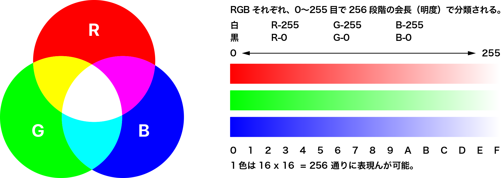

&nbsp;
&nbsp;

## RGBA指定

HTMLを始めプログラミング言語ではRGBの透過を意味するA（アルファ）を追加した表現を使用します。
例えば、R：255　B：0　G：0　A：127の指定で半透明の赤の指定になります。

&nbsp;
&nbsp;

## 16進数による色の指定
WebサイトではRGBカラーの階調を0〜255階調以外に16進数で記述する方法があります。
赤（Red）・緑（Green）・青（Blue）ともに色の強さは0〜9まで進み、次にA〜Fまであがります。
16進の色コードはハッシュ記号（#）が先頭に付与されます。

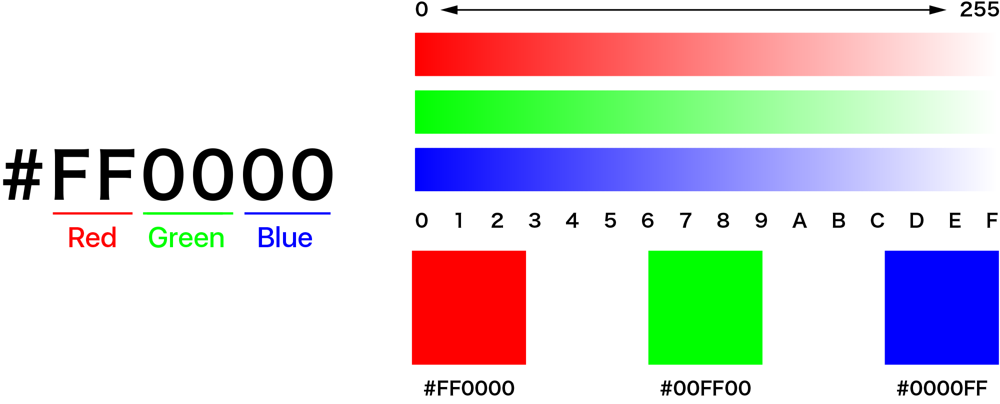

&nbsp;
&nbsp;




## 色の3属性
色には、明度、彩度、色相という三つの要素が存在します。この三つの要素の組合わせで創りだされる色は、さまざまなトーンを表現します。

&nbsp;
&nbsp;


## 明度 Brightness


明度とは、その色の明るさ明暗の度合いのことです。明度を数値で表すとすればその数値が高いほど、色は明るみを増すことになります。一番明度が高い色は白です。  明度は0〜100％で表現します。

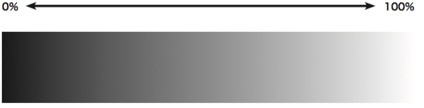  
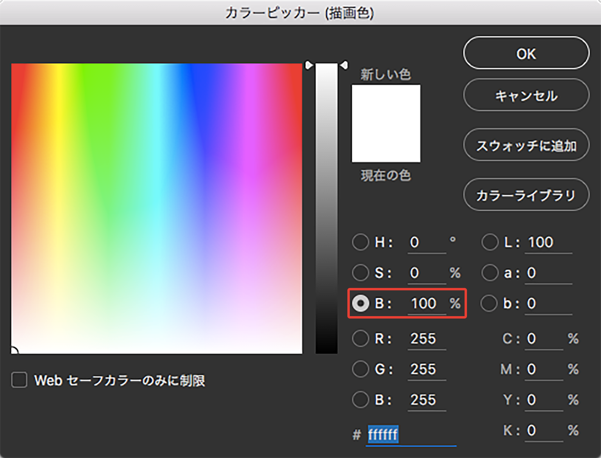


&nbsp;
&nbsp;

## 彩度 Saturation

彩度とは色の鮮やかさの度合いのことです。鮮やかさは、各色に白色や灰色、黒色などがどの程度混ざっているかによって変わり、濁りのない色、最も彩度の高い色を純色と呼びます。逆に色の鮮やかさが無い、白、黒、グレーを無彩色と呼びます。彩度は0〜100％で表現します。

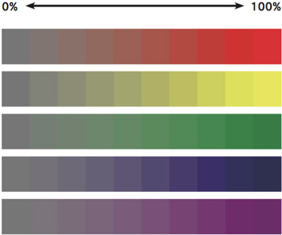
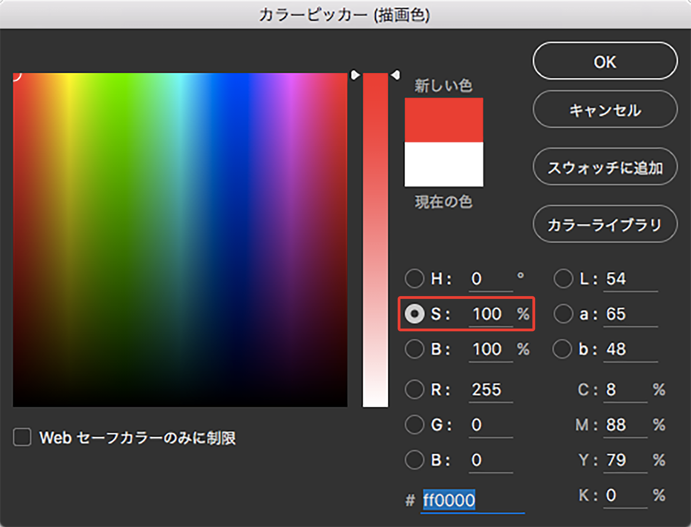

&nbsp;
&nbsp;



## 色相 Hue


色相とは赤、青、黄などの色味の違いのことです。色相は分類の方法によって異なりますが、主要な色相として赤、黄、緑、青、紫などがあります。これらを円状に並べ、各色の間にそれぞれの中間色を配置したものを色相環と呼んでいます。間隔を等しく配置した色相環で、中心点を通って反対側に位置している色相を補色と呼びます。また隣接する色を類似色と呼びます。 


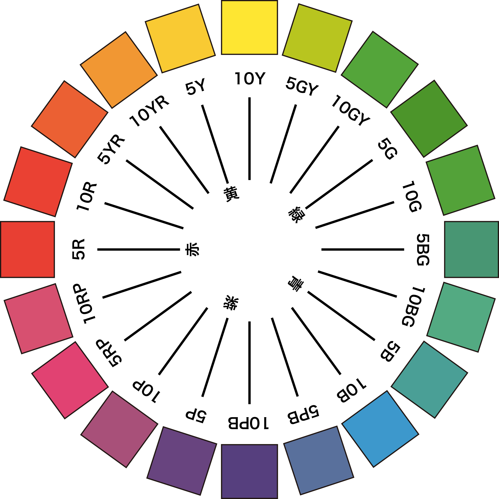  

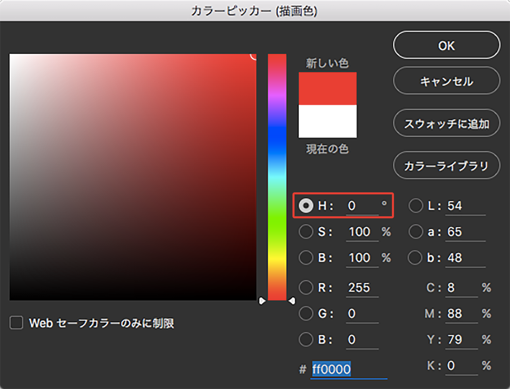


> Point: 配色のポイントとして、補色関係は色を引き立てて、類似色は馴染ませる効果があります。




&nbsp;
&nbsp;


## カラーイメージ  

単色そのものが持つイメージやキーワードがあります。例えばメインカラーを選ぶ時などは、色自体のイメージも考慮して検討する必要があります。

<!--  -->

* 有彩色
	* 赤: 情熱的、活動的、行動力、生命力、衝動、祝い、興奮、歓喜、危険、刺激
	* 黄: 柔かい、親しみやすい、陽気、自由、明るさ、未来、元気、幼稚、注意、希望
	* 青: クール、知的、冷静、保守的、爽やか、忠実、涼しさ、理想、誠実、信頼
	* 緑: 自然(ナチュラル)、癒し、やすらぎ、新鮮、平和、若々しさ、健康、田舎、平静、安全
	* 紫: 神秘、高貴、個性、ファッション性、神秘、優雅、哀れ、心配、上品、古典的
	
* 無彩色
	* 白: 清潔、純粋、誠実、勝利、真実、空虚、神聖、公明
	* 黒: 都会的、フォーマル、威厳、高級、格調、上品、悪、敗北、モダン
	* グレー: 先進的、合理性、地味、落ち着き、あいまい、平凡、哀愁、憂鬱

&nbsp;
&nbsp;

## トーン

トーンは明度と彩度を組み合わせたものです。 色相の同じ系列でも、明・暗、強・弱、濃・淡、浅・深の調子の違いがあります。この色の調子の違いをトーンと言い、このトーンの色空間を設定しています。 色相ごとに 12 種のトーンに分けられます。各色相からトーンの同じ色をまとめられています。明度の違いはあるものの、あざやかさの共通なグループができます。

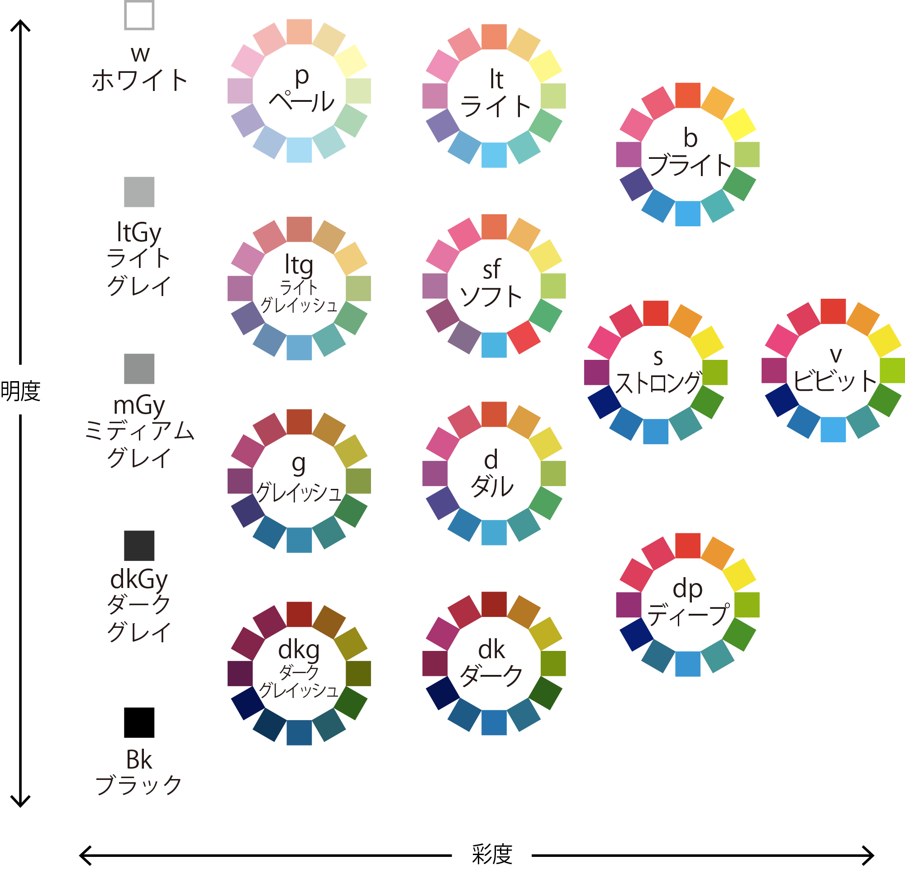

&nbsp;
&nbsp;

## トーンマップとキーワード
色合いなどを決めるデザイン企画の段階で、イメージカラーを決めていきます。その時にこのトーンマップを参考に、ターゲットに合った色を選択していくことで、時間短縮となり効率的な作業をすることができます。

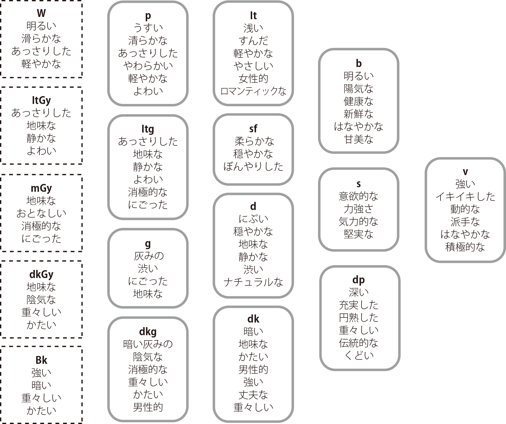

> Point: デザインのコンセプトからプライマリー色を決める場合、キーワードとトーンマップから考えると良いでしょう

&nbsp;
&nbsp;

##  配色パターン

Adobeのカラーライブラリサービス「Adobe Color CC」を使って配色パターンと効果を解説します。

[https://color.adobe.com/](https://color.adobe.com/)

### 類似色 Analogous 
同じトーンで色相を変化させた配色です。基本色を中心になじませる効果があります。
強すぎずソフトな印象を与える最も失敗しにくい配色です。

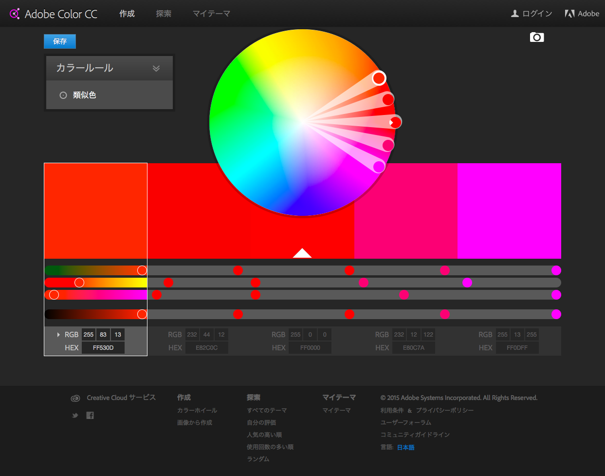

&nbsp;
&nbsp;

### モノクロマティック Monochromatic
同一色相で、トーン（明度・彩度）を変化させる配色です。効果的には類似色と同じくなじませることができます。
色相を変化させないので、基本色を保持したまま使い分けることができます。

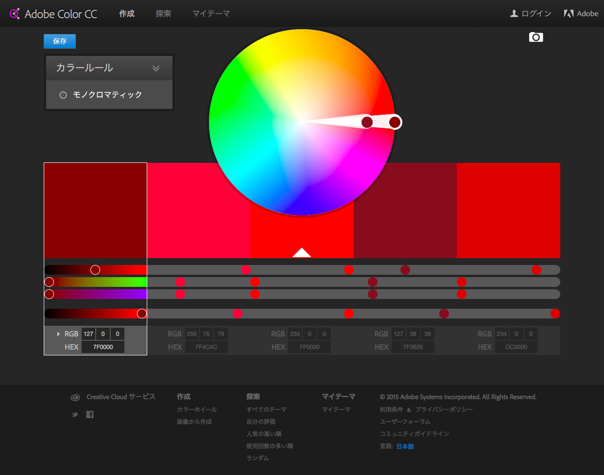

&nbsp;
&nbsp;

### 補色 Complementary   
色相環の反対側にある色を補色と言い、お互いに引き立てる関係を持ちます。例えば赤の場合は緑、黄色の場合は紫にあたります。アクセントとして使うと効果的でメリハリがつく配色です。

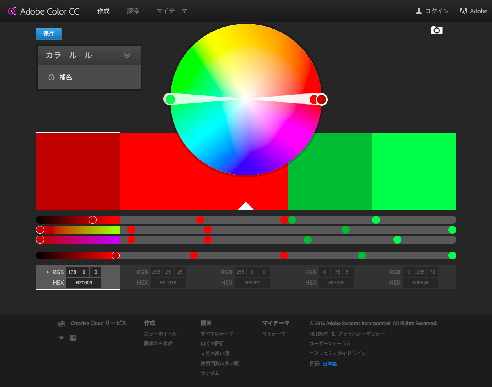

&nbsp;
&nbsp;

### シェード Shades 
同一色相で、明度差の変化を付けた配色です。基本色を元に濃淡のみで表現を行う場合に有効です。

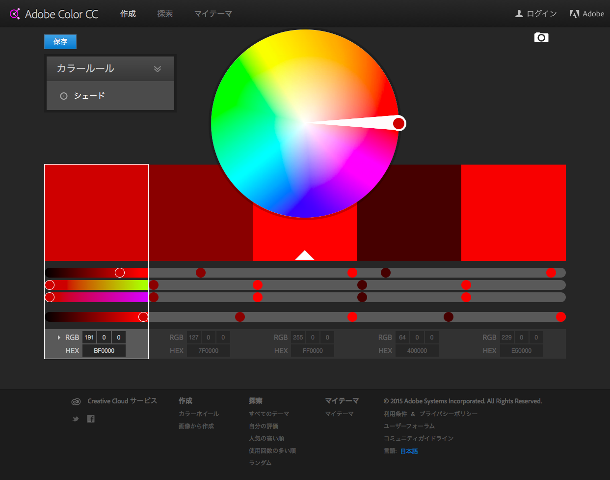

&nbsp;
&nbsp;

<!--#### カスタム Custom 
自分で自由にカスタムできます。アップロードした画像から配色を作ることもできます。

-->

&nbsp;
&nbsp;

## グラデーション

複数の色を混ぜ合わせるグラデーションは目的によって手法が異なります。

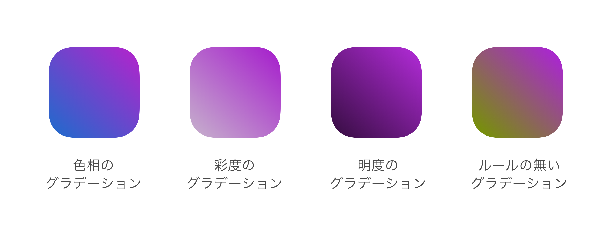

* 色相のグラデーションは虹の様な色の変化を与えます
* 彩度のグラデーションは特定の鮮やかさを強調したい場合に使います。
* 明度のグラデーションは明るい暗いの変化で立体的に見せます。
* 彩度も明度も揃わない規則性の無いグラデーションは濁ってしまいます。美しく表現することが難しくなります。
