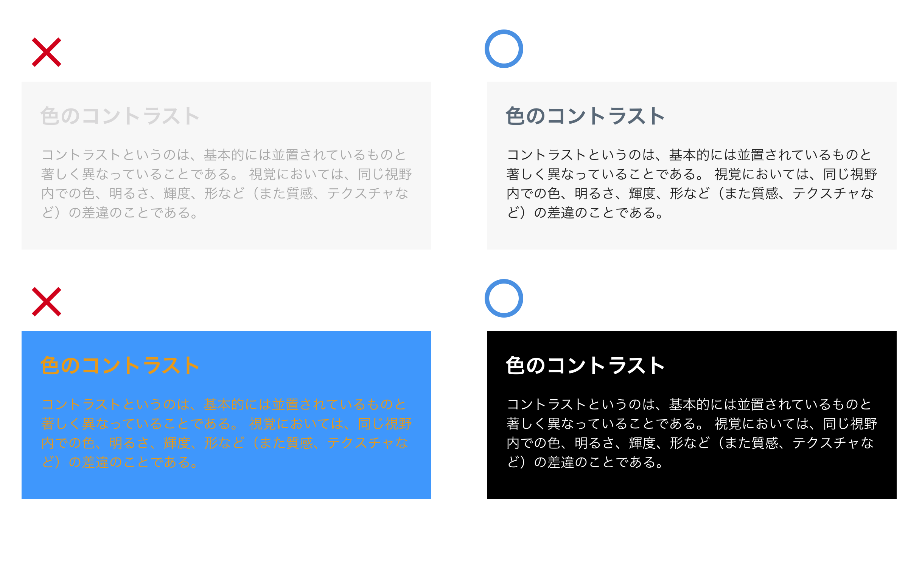

# Color

基本的な配色の考え方は、WEEK01のLESSON.3と変わりませんが、iOSに限らず、Androidなどのモバイルアプリケーションは、それぞれのデバイスに元々ある配色ルールがあります。
そのルールを理解したうえで配色設計を行わなければユーザーにとって使いづらいものになってしまいます。

&nbsp;
&nbsp;

## iOSの標準アプリで使用されているカラー

iOS7以降、デフォルトiOSカラーパレットがあり、プリインストールされているアプリで使用されています。

デフォルトのカラーパレットを使用し、独自の色をいくつか用いる場合、それぞれを組み合わせても問題がないようにしてください。たとえば、アプリケーションのスタイル上、パステル色が重要であるならば、調和する一群のパステル色を決め、一貫して使うようにし、色は多様しすぎないようにしてください。

&nbsp;
&nbsp;

## 配色設計

カラーでは配色の組み合わせによっていろんな表現ができますが、使う色の面積によっても印象は変わります。アプリやWebサイトのデザインは文字情報が中心となることが多いので、塗りすぎによって情報が伝わりにくくなることもあります。Delight UのWebサイトの「プライマリカラー」「セカンダリーカラー」「ベースカラー」を例に面積の比重を検証してみます。

&nbsp;

### プライマリーカラー
このブランド自身を表す基本色です。デザインの中で一番印象づける色となります。

&nbsp;

### セカンダリーカラー
プライマリーカラーと組み合わせて使う2番目に重要なカラーです。プライマリーカラーを引き立てる場合には補色系が選ばれ、なじませる場合には類似色系が選ばれることが多いです。
色面積がメインカラーよりも広くなると、メインカラーの役割が逆転してしまうので注意が必要です。

&nbsp;

### ベースカラー
文字情報の可読性はベースカラーにかかっています。アプリやWebデザインでは白から薄いグレーの無彩色か、有彩色だったとしても薄い配色を選ぶことで文字との明度差（コントラスト）を保つ必要があります。

## 無彩色と有彩色 

有彩色とは色相が特定できる色のことで、その色相の彩度の属性値が 0% 以上の色のことを指します。  
無彩色とは白、黒、グレー、といった色相や明度を持っていても、彩度の属性値が 0%の色のことを指します。

Webデザインやアプリのデザインでは情報を伝えるコンテンツの場合、10-20％の有彩色と80-90%の無彩色がバランスが良いと言われています。

&nbsp;
&nbsp;

##デジタルデバイスでの視認性
Web デザインではディスプレイを通して情報をユーザーに与えるため、情報へのアクセスのしやすさが必要とされます。[W3C](http://www.jsa.or.jp/stdz/instac/commitee-acc/W3C-WCAG/WCAG20/index.html) はウェブアクセシビリティガイドラインを設定していて、web ページに含まれる文字の読みやすさに関する測定手段を定めています。一度確認しておいてください。  (http://waic.jp/docs/WCAG20/Overview.html)

文字の視認性は文字色と背景色のコントラストによって決まります。コントラスト差が低い表現になるとユーザーは情報へのアクセスにストレスを感じる可能性が出てきますので注意しましょう。

&nbsp;
&nbsp;

## Light and Dark UI

眼への負担が少ないこともあり暗めのユーザーインターフェイス、通称「ダークUI」が普及しつつあります。明るいモードと暗いモードをユーザーが選択できる様になりつつあります。

