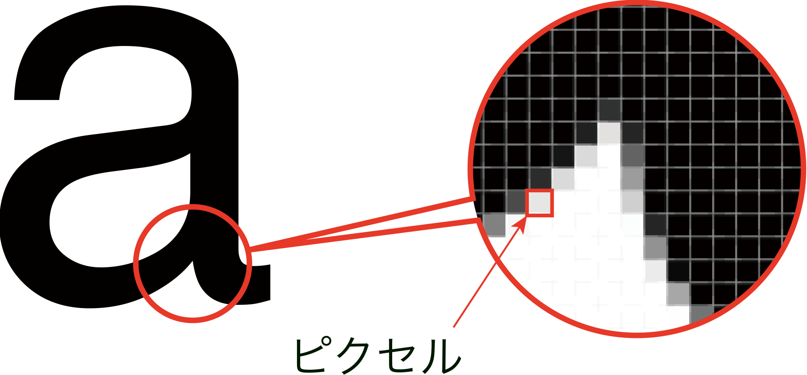
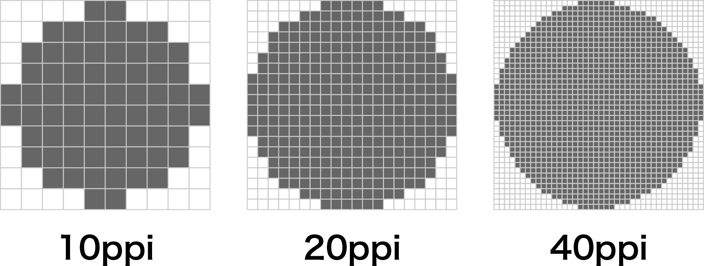
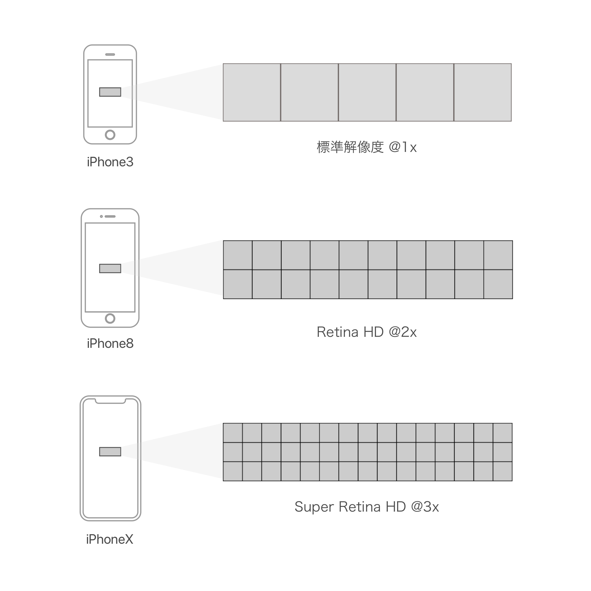
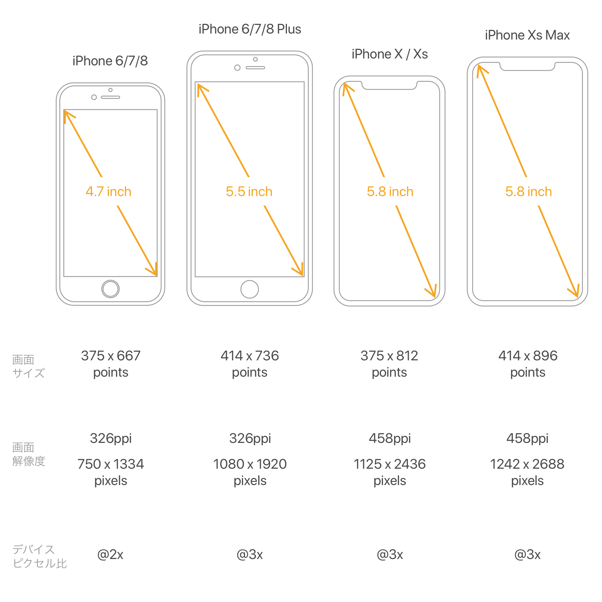
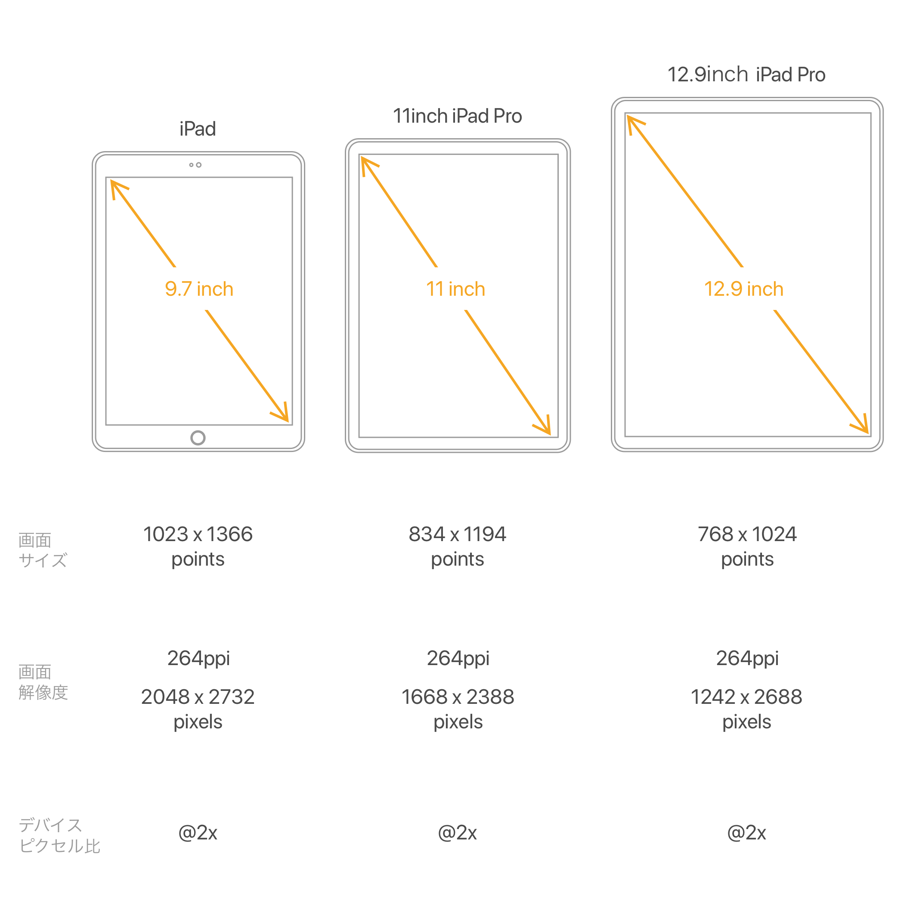
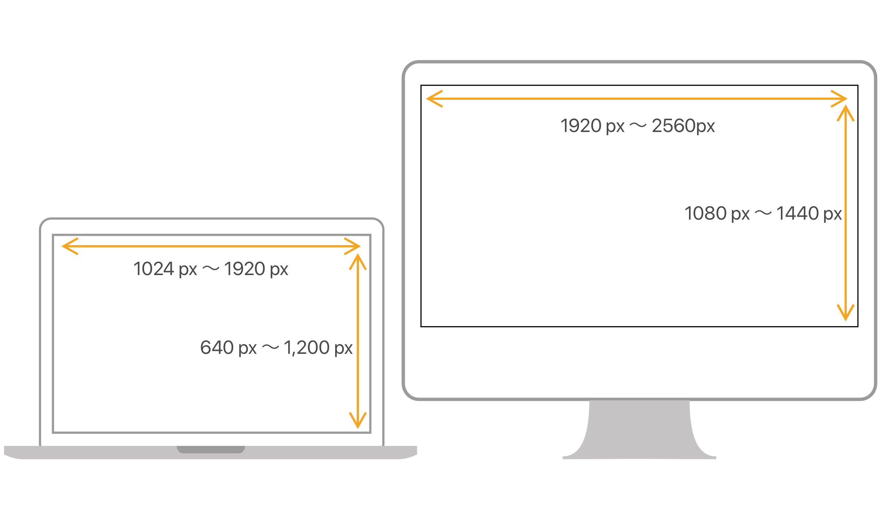
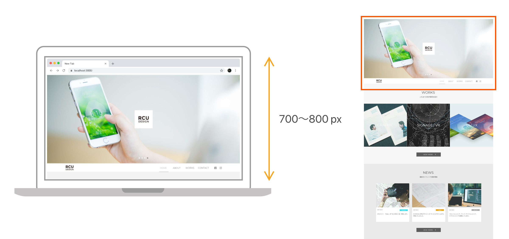

# デバイス

&nbsp;
&nbsp;

## ピクセル（画素）について
 
ディスプレイで画像を表示する際、画像は色情報を持つ小さな正方形の集合体として表示されます。ディスプレイ表示におけるこの最小の正方形はピクセル（px）と呼ばれ、デジタル画像の幅や高さを計る際の単位としても用いられます。また、ピクセルで構成された画像のことをビットマップ画像と呼びます。  
ピクセルには1px = ◯◯mmといった規則はなく、ディスプレイごとにその大きさは異なります。例えば、駅前の電光掲示板とスマートフォンでは、映し出す画像が同じでも、ピクセルの物理的な大きさは異なります。

 

&nbsp;
&nbsp;

## 解像度について
  
解像度は、ビットマップ画像におけるピクセルの密度を示す指数のことで、1インチ中に幾つのピクセルが並んでいるかをppi（Pixel Per Inch）を用いて示します。解像度は、“1インチのライン上にピクセルが幾つ並ぶか”を示す指数であり、1インチ×1インチの領域中（1平方インチ）に存在するピクセルの総数（総画素数）を示す指数ではありません。コンピュータなどのディスプレイは通常72ppiで表示されており、この解像度を標準解像度と呼びます。

 

> 最新のiPhone XsやiPhone XS Maxの解像度は458ppi、MacbookProは227ppiとなっています。

&nbsp;
&nbsp;

## デバイスピクセル比について

デバイスピクセル比とは、標準解像度の1ピクセルを高解像度デバイスのディスプレイでは、何ピクセルとして描画するかを指定するための指数のことです。デバイスピクセル比が2であれば縦横2倍の4ピクセル、3であれば縦横3倍の9ピクセルを標準解像度の1ピクセルとして描画します。HIGでは、デバイスピクセル比2を@2x、デバイスピクセル比3を@3xとして表記しています。
    

> ベクターソフトのillustratorやSketchでデザインする場合には1倍で、Photoshopでデザインする場合にには2倍が主流となっています。

&nbsp;
&nbsp;

## iPhone/iPadの画面サイズとピクセル比
iPhone 6/7/8plusからピクセル密度が400ppiを超え、デバイスピクセル比が3倍（@3x）となりました。Android端末ではデバイスピクセル比4倍（@4x）の端末も登場しています。

 
   

> Googleが過去から最新のものまで端末情報を比較できるサイトを公開しています。Google Material Design Device metrics　[https://material.io/tools/devices/](https://material.io/tools/devices/)

&nbsp;
&nbsp;

<!--

##Retina対応の画像の作成方法 -iOS Application-
スマートデバイス用アプリケーションの画像も、デバイスピクセル比2(@2x)を基準に行われています。従って、画像サイズはWeb用画像同様、実際の表示サイズの縦横2倍で作成します。  
-->

&nbsp;
&nbsp;

## PCの画面サイズ

ノートPC、デスクトップPCでは一般的な表示解像度はXGA(1024×768ピクセル)以上と言われています。またWide XGA(1280×768、1366×768)やSXGA(1280× 1024)WXGA+(1440×900)、フルHD(1920×1080)も増加傾向にあります。PCサイトのターゲットディスプレイは現在1280×800ピクセルが一般的で、PC向けWebサイトの横幅は**950〜1170px**の間が多いです。  

&nbsp;
&nbsp;

## ファーストビュー

Webサイトにアクセスしたらすぐに表示確認できる領域のことをファーストビューと呼びます。ブラウザのウインドウやツール領域を差し引くため、実質のレイアウトサイズは幅が1200x、高さが**700~800px**程度が妥当と言われており、Webのレイアウトでは、このサイズ辺りで作られることがが多くなりました。ファーストビューに最も訴求したい情報を収めることが重要とされています。 

&nbsp;
&nbsp;

