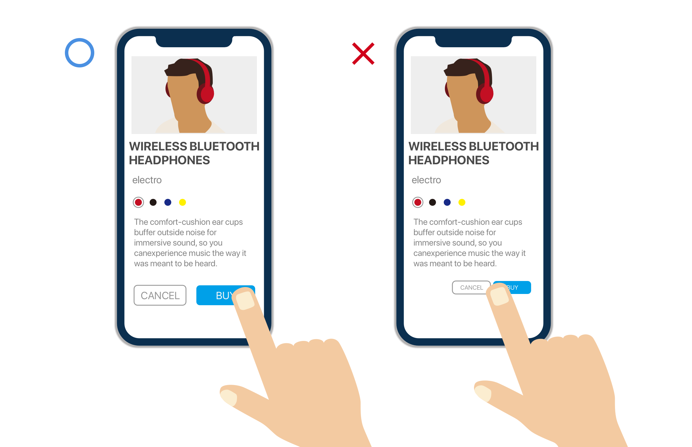
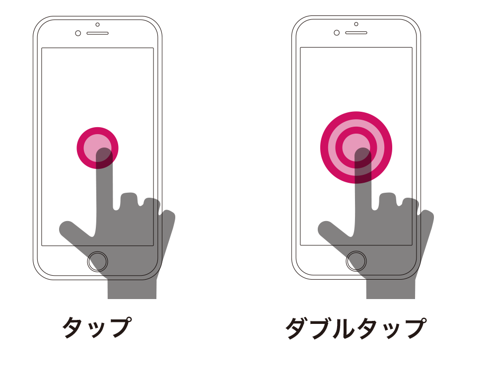
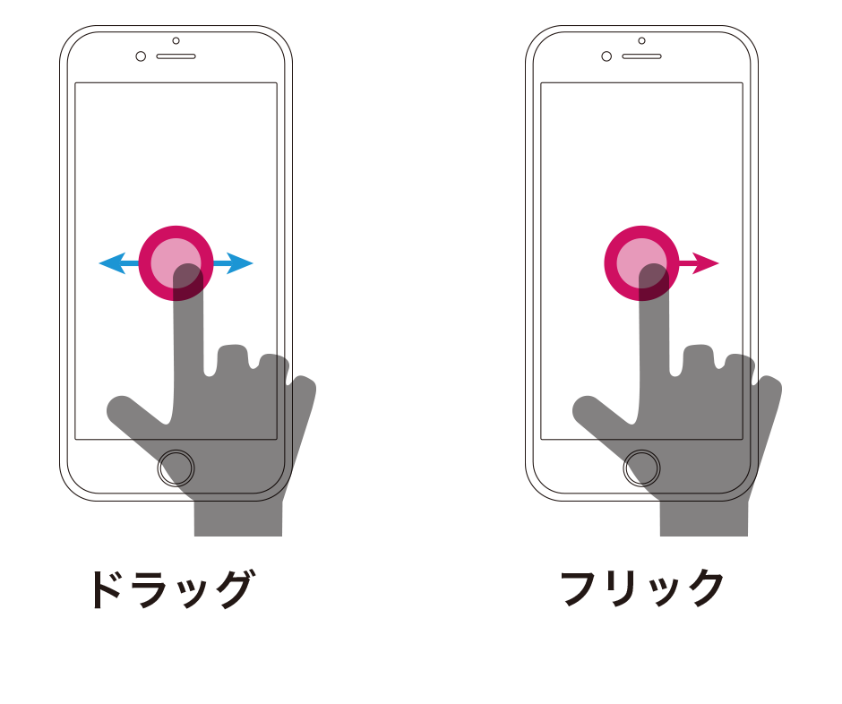
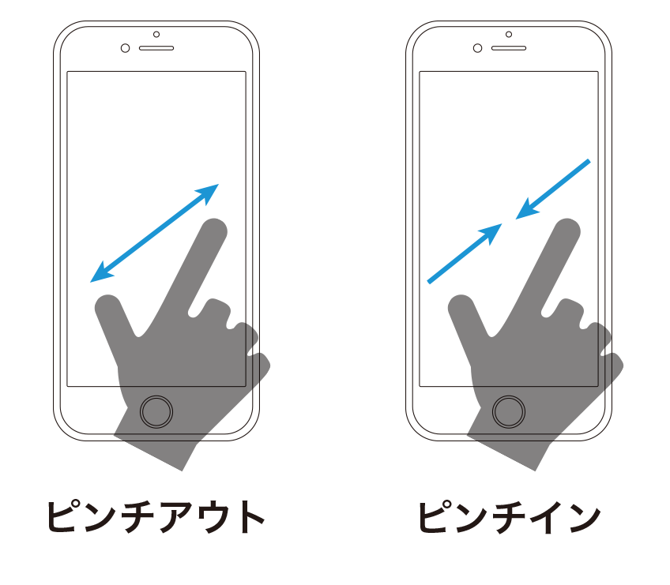
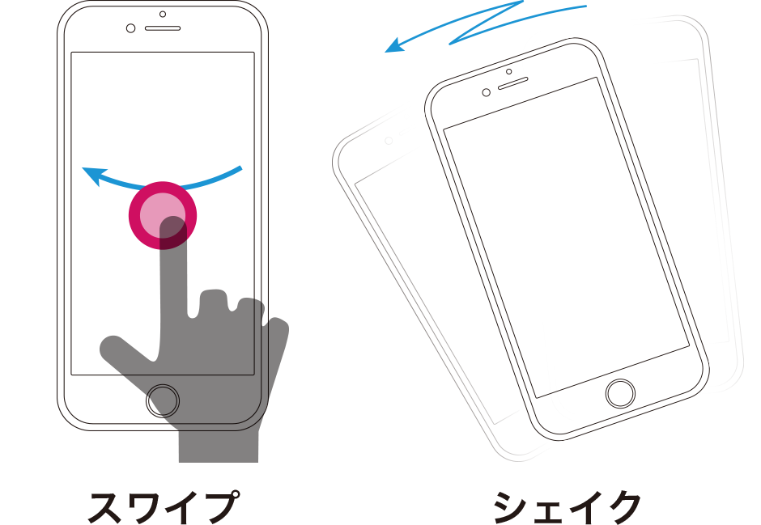
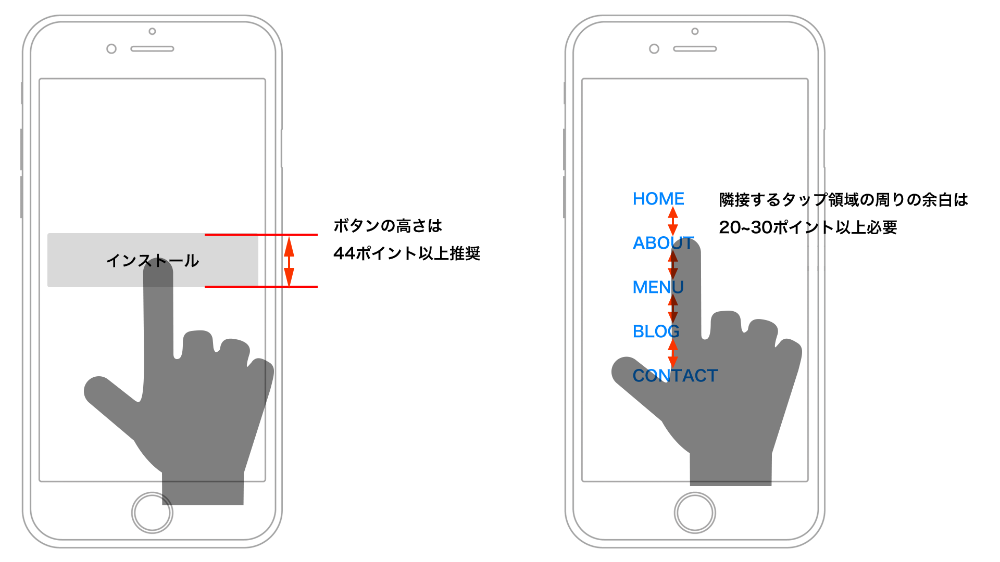

# ジェスチャー

> ### Scrolling is a continuation; clicking is a decision.
>  — Joshua Porter

 
&nbsp;
&nbsp;

## PCとスマートフォンの違い
PCによるマウス操作は小さな矢印「カーソル」を目的地に移動させる為、対象位置が小さくても到達しやすい。一方モバイルでは指による操作になるので画面に対して目的地が大きくなければ、押し間違える可能性が高い。

> スマートフォンのデザインではボタンなどのユーザーがタップする領域を十分に取るようにしましょう。HIGでは幅・高さ44ポイント以上が必要と述べています。

&nbsp;
&nbsp;

## スマートフォンのジェスチャー

タップ、ダブルタップ、ドラッグといったPCでも使われている基本操作に加えて、スマートフォン特有のフリック、スワイプ、ピンチアウト／ピンチインといったものがあります。また新しくAppleが独自に開発した、画面を押す強さによって様々な操作を行うことができる「3Dタッチ」が登場しました。

  

* タップ　
	* コンテツ部分のリンクやコントロール部品を押すことで次の遷移へつながります。
	* テキストの選択状態をつくることもできます。
	
* ダブルタップ
	* コンテンツ内の特定の箇所を拡大・縮小することができます。
	
&nbsp;

  

* ドラッグ	
	* 地図などの大きめのコンテンツで上下左右に移動することができます。

* フリック
	* 文字入力の際に使う、タップの直後に小さくスライドする操作です。
	
	
&nbsp;
&nbsp;

	
	
  
	
* ピンチアウト／ピンチイン
	* コンテンツや写真などの一部分を拡大する場合に2本の指で開く操作です。逆方向の閉じる操作は縮小となります。		 

&nbsp;
&nbsp;

  

* スワイプ
	* 画面を切り替える際に大きく掃く様にスライドします。

* シェイク
	* アクションを取り消したり、既存のステイタスをリセットする際に使います。

&nbsp;
&nbsp;

[Gestures | HIG](https://developer.apple.com/design/human-interface-guidelines/ios/user-interaction/gestures/)

<!--

## ボタンサイズ

スマートフォンのデザインではボタンなどのユーザーがタップする領域を十分に取るようにしましょう。HIGでは幅・高さ44ポイント（88ピクセル@2×）以上が必要と述べています。テキストから遷移する場合でも、周りに十分な領域がなければ、意図しないリンクを選んでしまう可能性があるので注意しましょう。

  
-->

