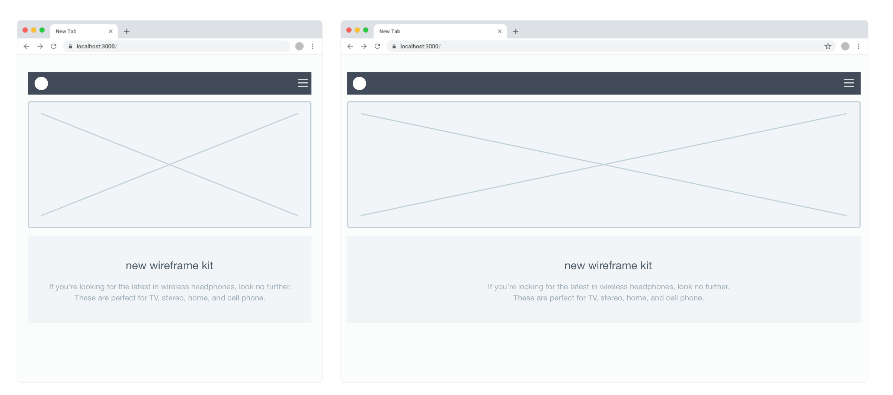
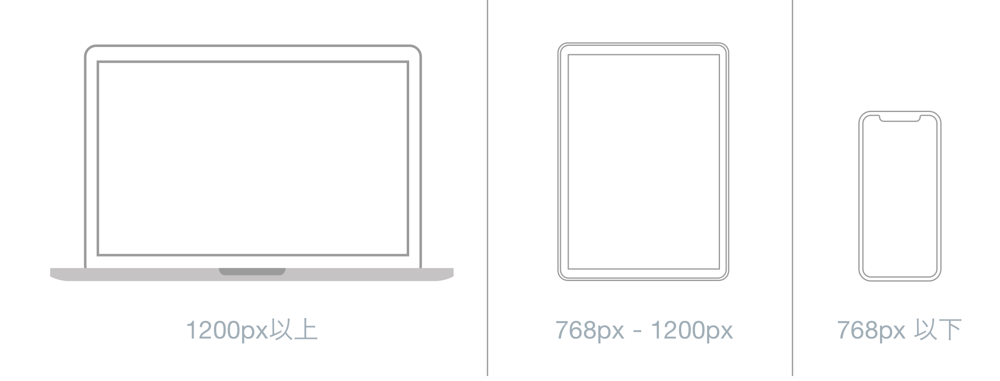

# レイアウト

---

&nbsp;
&nbsp;

## 固定レイアウトとリキッドレイアウト

### 固定レイアウト
ブラウザのウインドウが広がるとコンテンツは中央に配置され、左右の余白が広がる

&nbsp;
&nbsp;

### リキッドレイアウト
ブラウザのウインドウが広がると、横幅に合わせて左右に広がる

&nbsp;
&nbsp;

### 可変グリッド
ブラウザのウインドウが広がると、横幅に合わせて段組み（カラム）が増えていく

&nbsp;
&nbsp;

## レスポンシブWebデザイン
WEBサイトの閲覧には、PCやスマートフォン、タブレットなど様々なデバイスが用いられています。レスポンシブ・ウェブデザインは、WEBサイトがこうした異なるデバイスでの閲覧を受けた際、単一のHTMLファイルを用いそれぞれのデバイスに最適化されたビジュアル（視覚イメージ）を表示させるためのデザイン手法です。“ウェブ”を省略して、単にレスポンシブ・デザインとも呼ばれます。  

 
　

&nbsp;
&nbsp;

## ブレークポイント

ブレークポイントとは、レスポンシブ・デザインでビジュアルの最適化（ビジュアルの切替え）を行うために、予め設定する“切替え値”のことです。この値は、下図の通りターゲットとする閲覧デバイスの表示領域を含む“範囲”で指定されます。ここで注意が必要なのは、スマートデバイスに縦表示（ポートレイト）と横表示（ランドスケイプ）があることです。デバイスを縦に見ている時はスマートデバシス用のビジュアルだったのに、横表示させたらPC用のビジュアルに変わってしまうといったことは好ましくありません。ブレークポイントはポートレイト、ランドスケイプいずれの表示幅も含むよう設定します。

| Extra small | Small | Medium | Large | Extra large |
|:----------:|:-------------:|:-------------:|:-------------:|:-------------:|
| <576px | ≥576px | ≥768px | ≥992px | ≥1200px |

[Bootstrap Breakpoints](https://getbootstrap.com/docs/4.3/layout/grid/)

&nbsp;
&nbsp;

## グリッドシステム

レスポンシブデザインの様に端末ごとカラム（段組）の数を変動させる場合には、グリットシステムを用いることで効果的にレイアウトできるようになります。カラムの数は、主に2カラム/3カラム/4カラムが使われる機会が多いため、現在では**12カラム**のグリッドが主流となっています。  
以前は1000px以下のWebサイトが多く、幅960pxのグリッドシステムが主流でした。([960grid](https://960.gs/))

現在では、[Bootstrap Framework](https://getbootstrap.com/docs/4.0/layout/grid/)
で使われている幅1170pxのグリッドを使ったサイトが増えています。

ここで注意が必要なのは、必ずしも製作時に使用するグリットシステムのカラム数を実際のWEBページのカラムパターンと一致させる必要はないということです。例えば、12カラムのグリッドシステムを用いて5カラムのパターンは組めません。部位によってグリッドを使わない選択肢もあります。

 

* [Sketch Gridsystem Download](img/gridsystem.sketch)

---