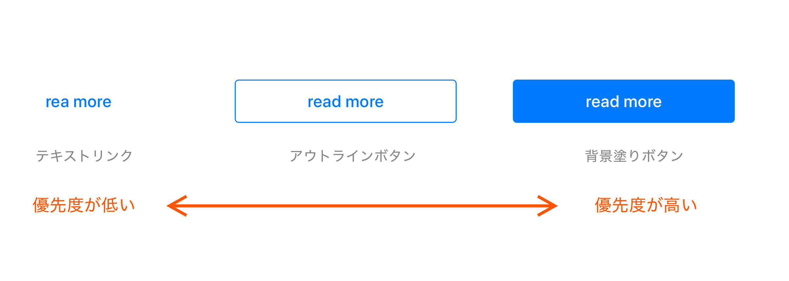
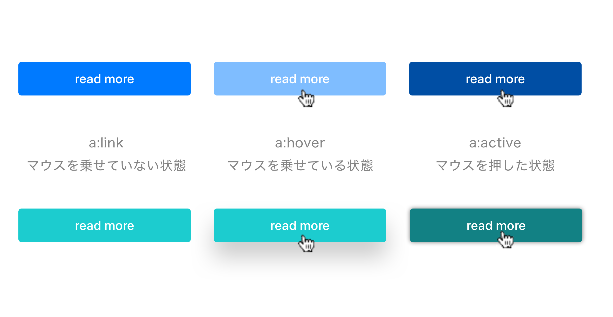
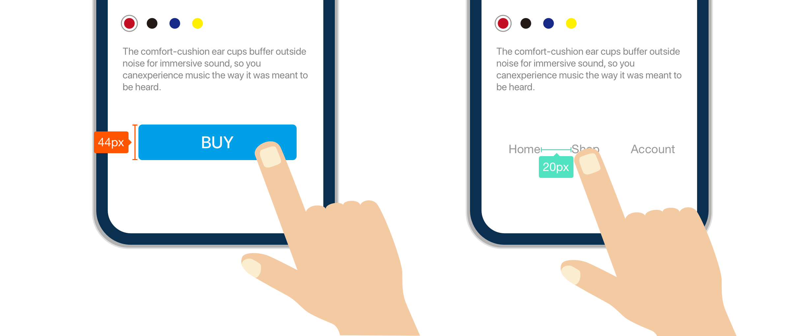

# ボタン

---

&nbsp;
&nbsp;

ボタンは、何らかの仕組みや装置が有する機能の使用（オン）・不使用（オフ）を切り替えるための装置を指しますが、Webサービスでもリンク機能など明示するUI（ユーザーインターフェイス）として広く利用されています。
またボタンにはユーザの操作に対する反応（インタラクション）への対応も必要となります。このレッスンでは、インタラクション設計などの概念について理解を深め、ユーザビリティの高いボタンの設計法を学びます。

&nbsp;
&nbsp;

## ボタンの優先
Webサービスでは、異なるページ間の移動にリンクを利用します。リンクとは、現在閲覧中のコンテンツ以外のコンテンツへ遷移するための経路、あるいは機能のことですが、その優先度に応じ、テキストリンク、ボタン、ナビゲーションと呼称が変化し使い分けられています。この優先度を良く確認、理解しデザインを行いましょう。  
  
  

&nbsp;
&nbsp;

## インタラクション

ボタンはユーザーが操作する部位です。ユーザーは、ボタン操作時に起こるアクション（色変化等の反応）によってその部位が操作可能であるこを認識し、操作の結果を想起します。この操作とそれに対するアクション（反応）のことをインタラクション（相互作用）と呼びます。
インタラクション設計は色や形、動きや音などで表現されます。ユーザーはナビゲーションへの操作に対して適切な反応を明示されると安心感を覚えます。
例えばボタンの上にマウスをのせて、ボタンの形が凹む様な挙動を返すことによってリンクできることを体感します。  

&nbsp;
&nbsp;

## ボタンのアクセシビリティ

スマートフォンのデザインではボタンなどのユーザーがタップする領域を十分に取るようにしましょう。HIGでは幅・高さ44ポイント（88ピクセル@2×）以上が必要と述べています。テキストから遷移する場合でも、周りに十分な領域がなければ、意図しないリンクを選んでしまう可能性があるので注意しましょう。

&nbsp;
&nbsp;

---
