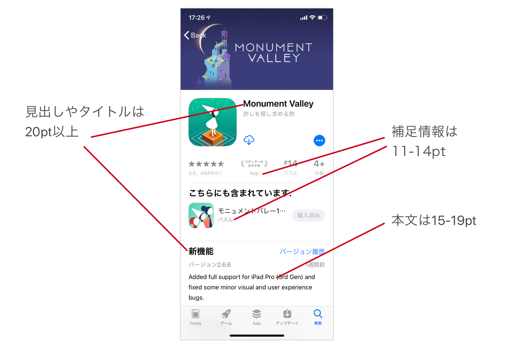
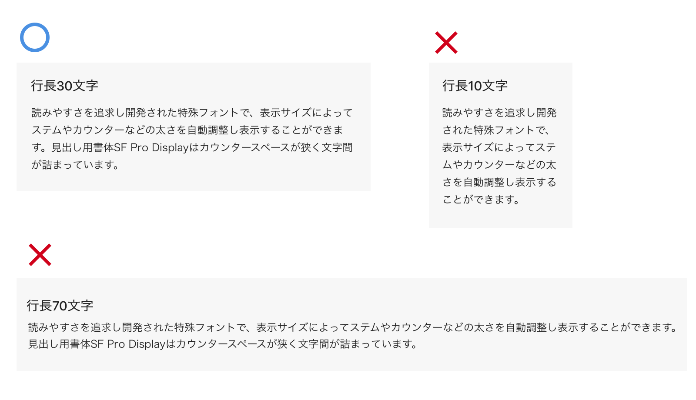
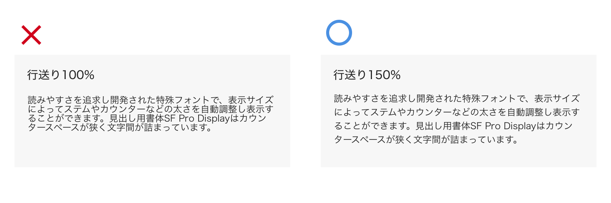
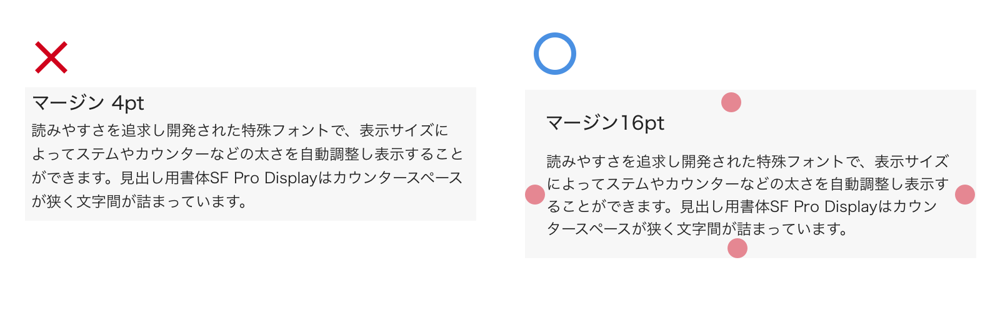
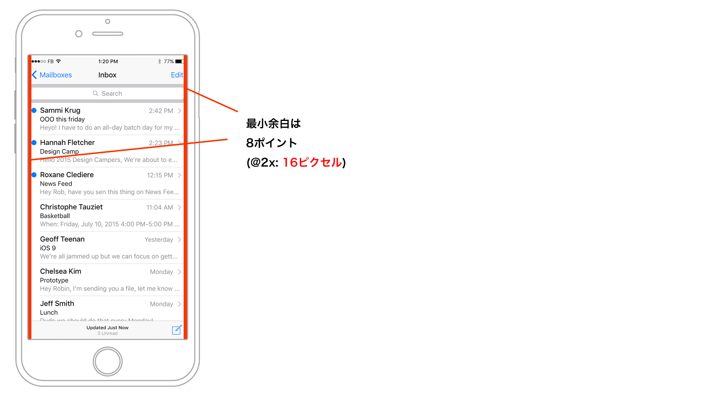
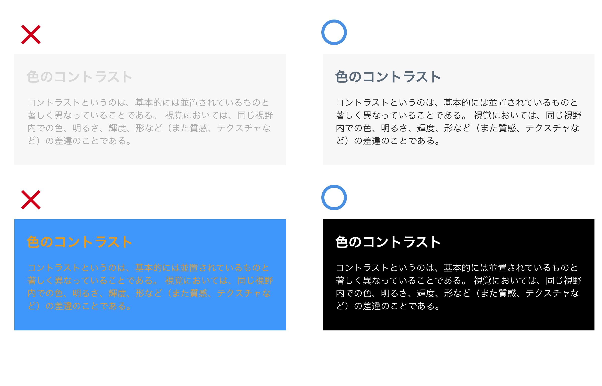

# Webデザインのタイポグラフィ

---

&nbsp;
&nbsp;

## フォントサイズ / フォントウェイト

HIGでは本文のフォントサイズは15ポイントから19ポイントの間、見出しは20pt
以上が推奨されています。ただし元々欧文書体は和文書体よりも作りが小さい為、この指定から1、2pt下げても有効です。ガイドラインでは最小サイズは11ポイントと決まっています。これは準拠する必要があります。
スマートフォンの小さいデバイス画面では文字情報の差別化を表すのにウェイトの変更は有効です。Boldなどウェイトが太いものはタイトルや見出しで使われます。中間のRegularやMediumウェイトは本文や補足文として使われます。小さいフォントサイズで細めのLightやThinを使用すると可読性が下がるので十分注意しましょう。

  

&nbsp;
&nbsp;

## 行長

段落には読みやすい行の長さがあります。行長が短か過ぎると、読むユーザーは何度も視線を折り返すために読み疲れてしまいます。逆に行長が長すぎると、折り返す距離に視線が疲れてしまいます。読みやすい適度な長さ・文字数は端末と眼の距離にもよるので一概には言えませんが、欧文で45~90文字、和文で20〜40文字程度と言われています。

> Point:スマホアプリやWebのデザインでは流し読みが多いので、適切な行長を設定する際には特に配慮する必要があります。

&nbsp;
&nbsp;

## 行送り

行送りは重要な要素です。行送りを狭くとるとユーザーに窮屈な印象を与えて読みづらく感じさせます。デジタルデバイスでの読みやすい本文の行送りは、一般的にフォントサイズの140〜180％程度と言われています。

&nbsp;
&nbsp;

## 余白

 
余白はデザインの重要な要素のひとつです。同じフォントサイズ・行送りだったとしても余白の使い方で読みやすさが変わります。余白が少ないと窮屈に見え文章が読みづらくなります。iOSのUIデザインではiPhoneの画面が小さいのでより余白に配慮する必要があります。

 

HIGでは最小余白を8ポイント以上としています。スマートフォンのデザインでは余白を8の倍数で意識して組むことが多いです。

 

&nbsp;
&nbsp;

##デジタルデバイスでの視認性
Web デザインではディスプレイを通して情報をユーザーに与えるため、情報へのアクセスのしやすさが必要とされます。[W3C](http://www.jsa.or.jp/stdz/instac/commitee-acc/W3C-WCAG/WCAG20/index.html) はウェブアクセシビリティガイドラインを設定していて、web ページに含まれる文字の読みやすさに関する測定手段を定めています。一度確認しておいてください。
文字の視認性は文字色と背景色のコントラストによって決まります。コントラスト差が低い表現になるとユーザーは情報へのアクセスにストレスを感じる可能性が出てきますので注意しましょう。

&nbsp;
&nbsp;



## Webフォント
インターネットの通信回線でユーザーにフォントデータをダウンロードさせます。環境に依存せずどのブラウザでも指定したフォントで表示することができます。

* [Google Fonts](https://fonts.google.com/)
* [Type Kit](https://fonts.adobe.com/typekit)

&nbsp;
&nbsp;

----

