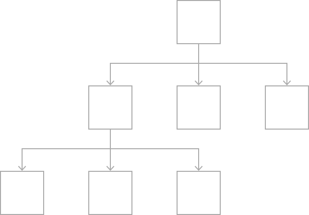
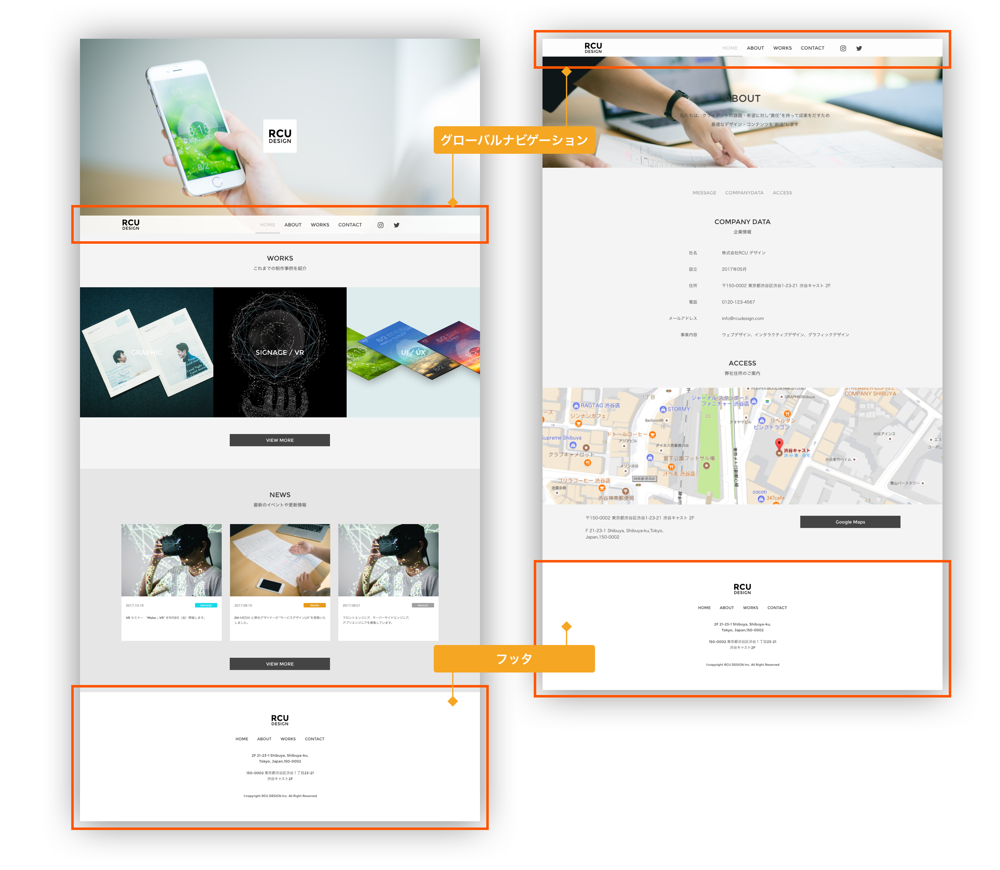
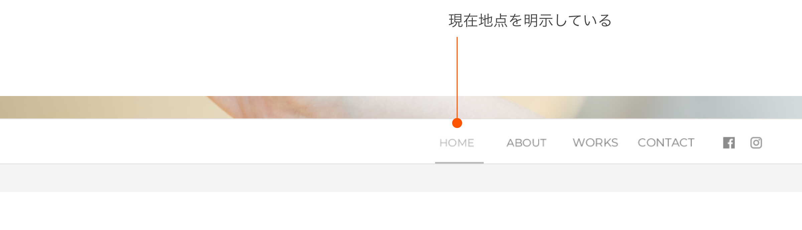

# ナビゲーション
ナビゲーションは、“ユーザーをサイト内の情報へと誘導する”、“サイト内でのユーザの位置を知らせる”など重要な役割を担います。その種類や機能は設置場所や目的に応じ様々で、それらを正しく理解し、適切に選択・使用することはWEBデザインにおいて非常に重要です。

&nbsp;
&nbsp;

## 階層型 

iPhoneアプリで最も多いパターンが階層型です。情報をリスト化しリストの概要文やサムネイル写真を選ぶことで、詳細画面へと進みます。

&nbsp;
&nbsp;

## グローバルエリア
ヘッダやフッタなど同一サイト内に共通して配置される領域はグローバルエリアと呼ばれ、ページ遷移しても同一サイト内にとどまっていることを明示するブランディング的な役割があります。グローバルエリアは、常に上位階層に戻れるロゴのリンクや第2階層カテゴリトップへ移動できるグローバルナビゲーション(メインナビゲーションとも呼ぶ)、頻繁に訪れるヘッダの親切ナビゲーションを要します。  

&nbsp;
&nbsp;

## Webページの各ナビゲーション

ユーザーインターフェイスとは直訳すれば「2つの情報のやりとりを仲介するもの」という意味になります。Webデザインでは、画面の中のコンテンツと、ユーザのアクセスを繋ぐ役割を持ち、PCやスマートフォンのOSや、Webデザインなどグラフィックを使ったインターフェイスをGUI(Graphical User Interface)と呼びます。  
ユーザーを情報へと導くためのナビゲーションやボタンなど操作に関わるものが該当します。  

&nbsp;
&nbsp;


## ナビゲーション設計の概要
初めてサイトを訪れるユーザーに、ストレスの無い情報の提示や、ページ間の遷移を提供するため、適切なインターフェイス設計が必要になります。リンク箇所は明らかにリンクできると明示する必要があります。  
ユーザーの主なページ間移動の手段としては、ナビゲーションが挙げられます。サイト内でナビゲーションの役割を明確に表すことで、移動手段(リンク)の優先順位を明示することができます。  
ナビゲーションによるページ間遷移は時にユーザーが現在地点を見失う可能性があるため、例えばナビゲーションのボタンの形状で自分の位置:現在地点とリンクできる位置:目的地点を明示する必要があります。  



&nbsp;
&nbsp;

## グローバルナビゲーション
グローバルナビゲーションはメインナビゲーションとも呼ばれ、上位階層のトップレベルや第2階層のカテゴリトップへ移動できるナビゲーションです。全ページに共通して同じ位置に配置することにより、“ユーザーが自然にメインのナビゲーションであることを学習しやすい”という特長があります。ユーザービティティ上、重要な役割を持つ機能です。  

&nbsp;
&nbsp;

## ローカルナビゲーション
ローカルナビゲーションは、下層のカテゴリ間を遷移します。カテゴリによってメニュー項目が変更されるので 上位階層に戻る際にはメインナビゲーションか、階層表現を行うパンくずナビゲーションを使って戻ることになります。  

&nbsp;
&nbsp;

## 機能ナビゲーション（ヘッダ/フッタ）
ヘッダやフッタなどのグローバルエリアに配置するアクセスマップやサイトマップ、お問い合わせ、テキスト検索など、ユーザーがどの階層にいたとしても頻繁に使うものです。  
ヘッダとフッタのどちらに配置するかは、コンテンツの優先度で決められることが多いです。カテゴリに収まりにくい、ユーザー規約やプライバシーポリシーなどが入るケースが良く見受けられます。  

&nbsp;
&nbsp;

## パンくずナビゲーション
補助ナビゲーションとして、現在位置からトップページまので階層をレベルで表記します。ユーザーは辿った階層をそのまま戻れるので、利用頻度の高いナビゲーションになります。この機能はトップページには必要ないため 第2階層以降で表示されることが多いです。  

&nbsp;
&nbsp;

## ステップナビゲーション
ステップナビゲーションは、検索結果など複数のページに分割して結果を返すコンテンツを順番に遷移する役割があります。番号による前後のリンクや、ページ数が多い場合、一番最初・一番最後のページに遷移するリンクを設けることもあります。  

&nbsp;
&nbsp;

## コンテキストナビゲーション
コンテンツ領域を使って文脈の流れで遷移を行うナビゲーションです。上位階層で概要文を掲載し、リンク先で 詳細文を表記すると、ユーザーは関心のある箇所のみをリンクするので、ユーザー導線として無駄のない遷移を提供することができます。  

&nbsp;
&nbsp;

---