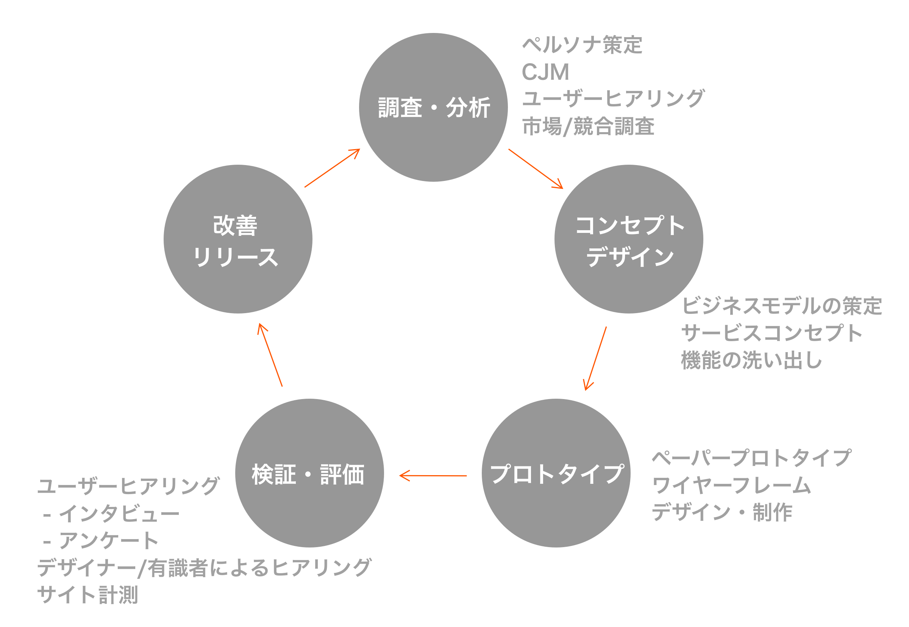
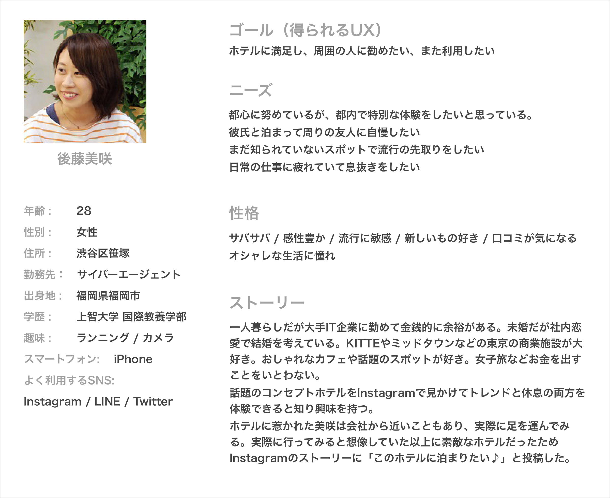
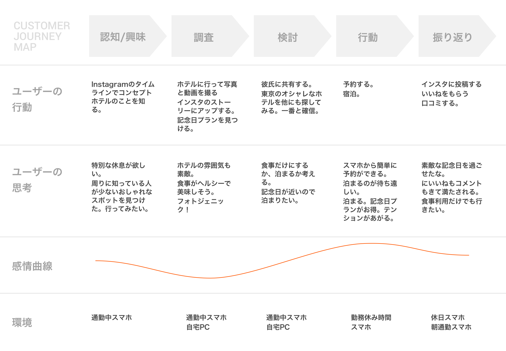
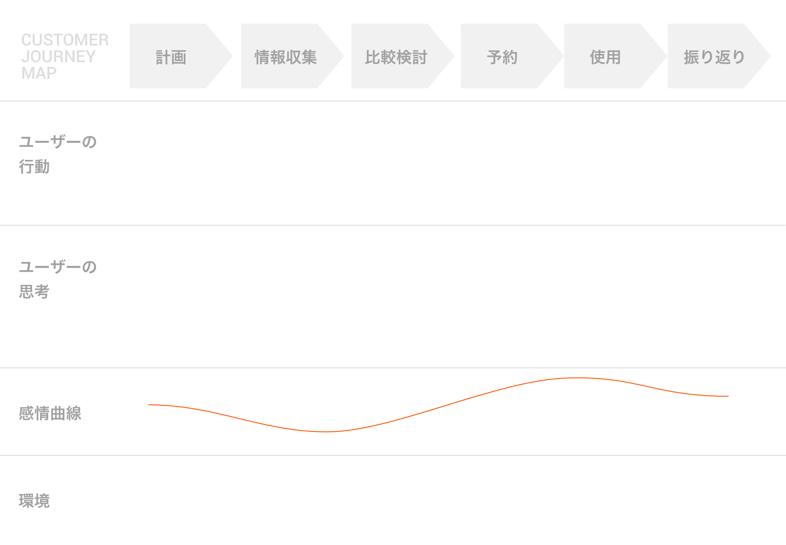
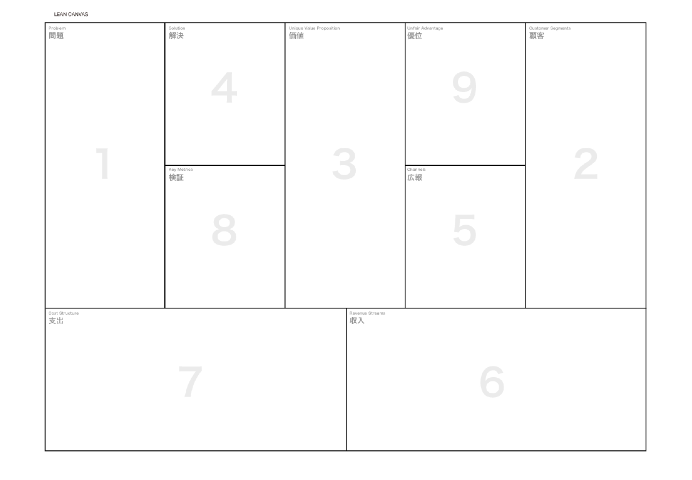
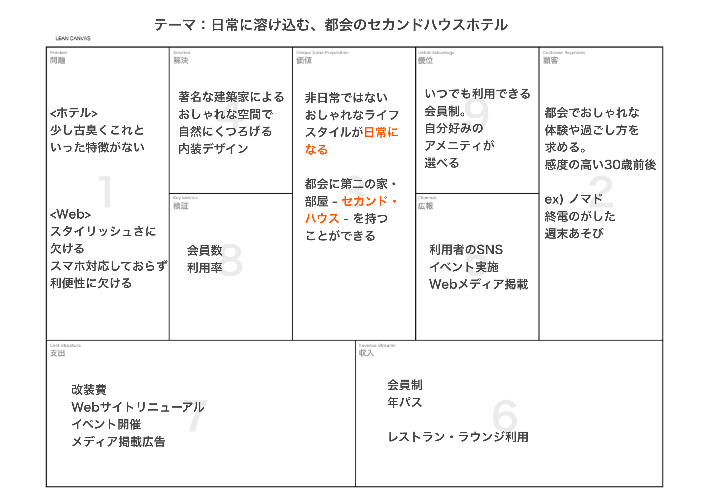

# UXデザイン

&nbsp;
&nbsp;

## UXデザインのプロセス 

&nbsp;
&nbsp;

## ペルソナ策定
対象のアプリを使うユーザーを仮想で人物像として設定したものを「ペルソナモデル」と呼びます。
ペルソナモデルはコンセプトのターゲットよりも具体的な属性を示します。（住所や職種、既婚・未婚など）またここで、スマートフォンにどれくらい慣れているか、普段はどのようなアプリを気に入って使っているかも想定すると良いでしょう。ペルソナモデルの気持ちになって、アプリを好んで使うシチュエーションを書き出すことを「ストーリー」と呼びます。ここで考えられたストーリーがこのアプリの必要な機能や特徴に繋がっていきます。  

&nbsp;
&nbsp;

## カスタマジャーニーマップ

ユーザーがサービスや商品を認知してから、最終的に予約や購買するまでの、カスタマーの「行動」、「思考」、「感情」などのプロセスです。

&nbsp;
&nbsp;

### ECや会員登録のカスタマジャーニーマップ

&nbsp;
&nbsp;

## リーンキャンバス

スタートアップのマネージメント手法として大きな脚光を浴びている「リーン・スタートアップ」の提唱者であるエリック・リース氏が提案するビジネスモデルの概要図（フレームワーク）です。

### 1 課題
ユーザーが抱えている課題を優先度が高い順に3つ書き出す。
課題に対しユーザーが利用している代替サービスがあれば書き出す。

&nbsp;

### 2 顧客
対象の顧客（ユーザー）を絞って書く。ペルソナモデル。

&nbsp;

### 3 価値
サービスの価値。コンセプトに繋がるキーワード。他社サービスや競合とは違うオリジナリティ。

&nbsp;

### 4 解決

課題を解決するソリューション。3の価値に基づいて解決できると良い。

&nbsp;

### 5 広報

どのようにユーザーに広げるのか告知方法。口コミやSNS・オウンドメディアなど

&nbsp;

### 6 収入
どのようにマネタイズするかプランを設定する。

&nbsp;

### 7 支出

初期コストと維持コストを含めて、どのような経費がかかるか

&nbsp;

### 8 検証

パフォーマンスを評価する指標はなにか。

&nbsp;

### 9 優位

競合サービスが簡単には真似できない優位性

&nbsp;
&nbsp;

---