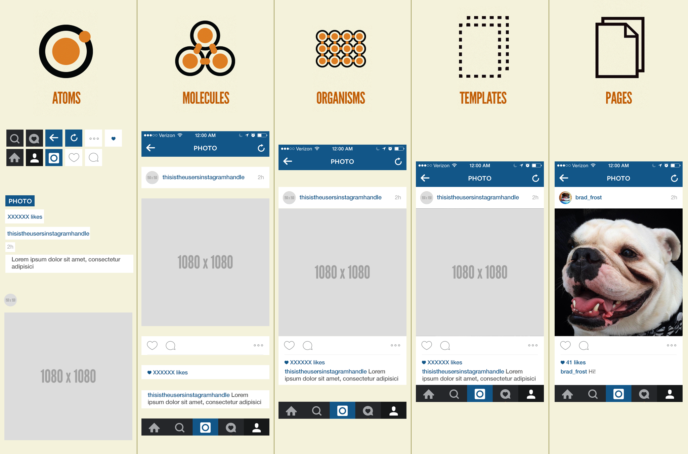

# アトミックデザイン

---

WebサイトやスマートフォンアプリのデザインをUIコンポーネントとして部品化し管理・実装する考え方（デザインシステム）です。

[Atomic Design by Brad Frost](http://atomicdesign.bradfrost.com/)

&nbsp;
&nbsp;

## コンポーネント

UIのパーツを部品（コンポーネント）としてパーツの組み合わせでページができあがると考える。Sketchのシンボルもこの考え方に基づいている。

&nbsp;
&nbsp;

## アトミックデザインのフロー
原子（Atomic）を最小の部品と考えて、分子（Molecules）、有機体（Organisms）、テンプレート（Templates）、ページ（Pages）の5つの流れで組み立てていきます。

&nbsp;

&nbsp;

### Lv1: 原子（Atoms）
最小単位で基本となる部品です。配色、フォント指定、ボタン、アイコン、テキストラベル、フォームパーツ、画像のビューなどUIの最小単位のパーツが含まれます。

&nbsp;
&nbsp;

### Lv2: 分子（Molecules）
複数の原子を組み合わせて目的別に小グループを作ります。

&nbsp;
&nbsp;

### Lv3: 有機体 (Organisms）
分子を組み合わせて、ナビゲーションやヘッダ・フッタなどが中・大グループを作ります。

&nbsp;
&nbsp;

### Lv4: テンプレート (Templates)

分子や有機体を組み合わせてページの構造を作ります。この段階ではテキストや画像はダミーです。

&nbsp;
&nbsp;

### Lv5: ページ (Pages)

テンプレートに実際の画像やテキストなどを入れた最終形態です。

&nbsp;

&nbsp;
&nbsp;

