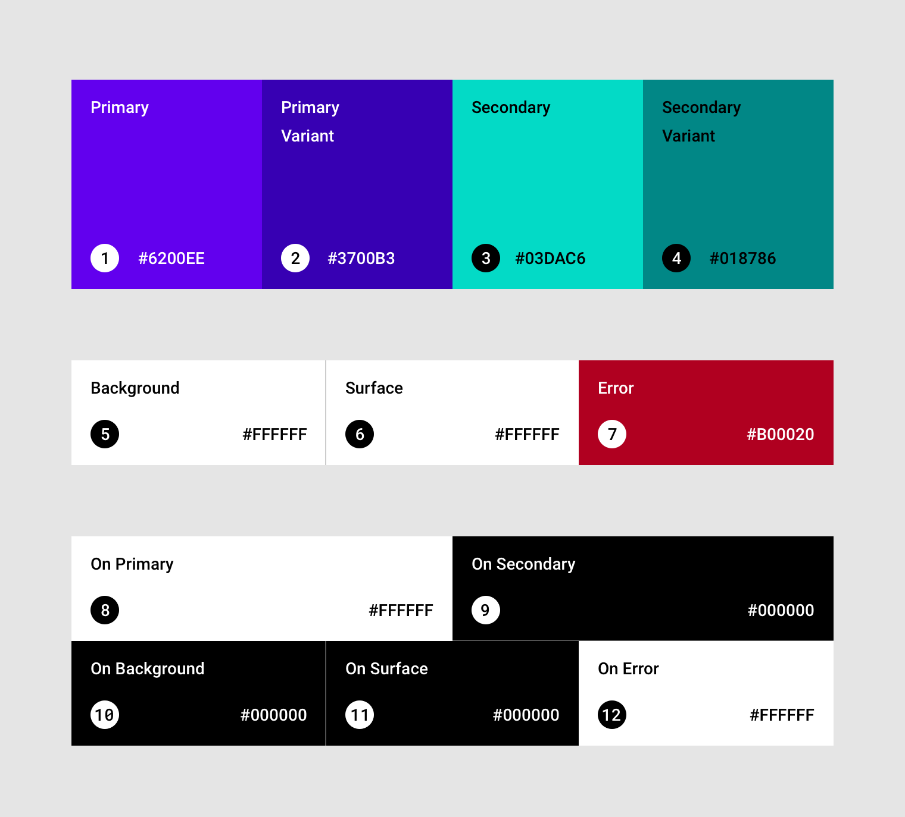
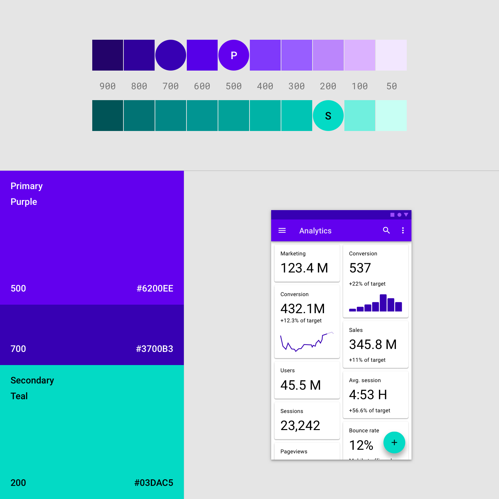
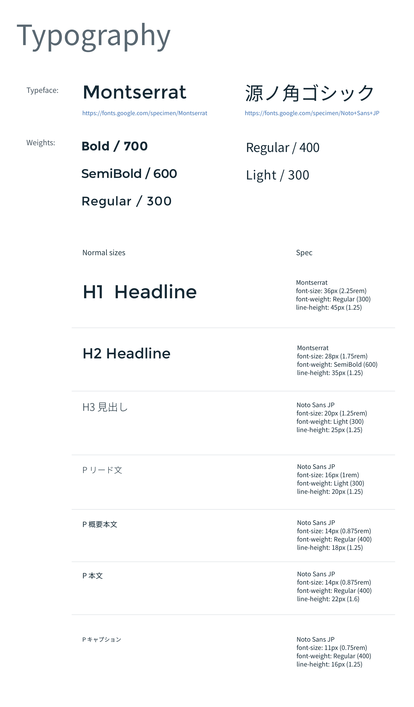
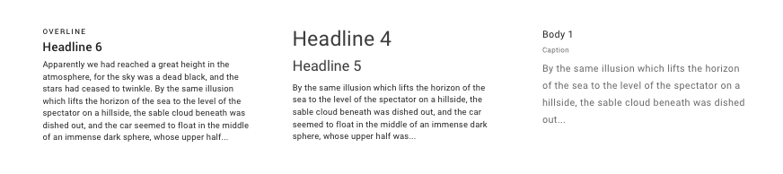
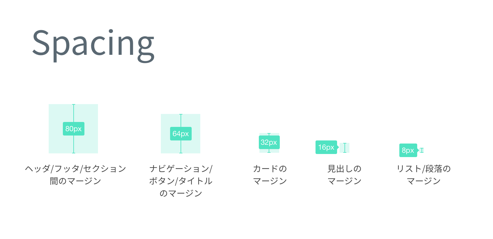
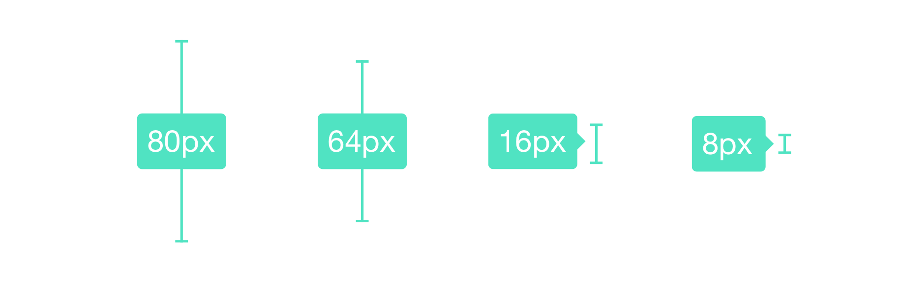
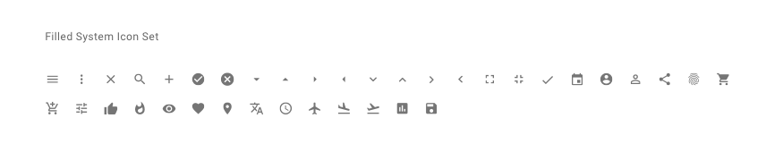

# スタイルガイド

## カラー　Color

&nbsp;

### プライマリーカラー

最重要となるメインの一色です。ブランドカラーであったりアプリや画面の主要色を指します。プライマリーカラーのコントラストを変化させた色を補足に用意しておくとUIで使いやすくなります。

&nbsp;

### セカンダリーカラー
二番目に重要な色です。アクセントであったり、選択部分に使われます。セカンダリーカラーのコントラストを変化させた色を補足に用意しておくとUIで使いやすくなります。

&nbsp;

### UIカラー

* 背景色
* 警告色
* 成功色

&nbsp;

### テキストカラー
文字の色です。可読性に十分注意して、背景色とのコントラストを付けましょう。

* テキストカラー
* ホバー（PCのみ）
* ハイライトカラー（スマホのみ）

&nbsp;
&nbsp;

## タイポグラフィ　Typography

* 書体の種類
* ウェイト
* フォントサイズ
* トラッキング
* 行送り

&nbsp;

### 段落

* 行長
* 行送り

&nbsp;
&nbsp;

## Layout

### グリッド

&nbsp;

### ブレイクポイント

| Mobile | PC |
|:----------:|:-------------:|
| <768px | ≥768px | ≥992px | ≥1200px |

&nbsp;
&nbsp;

## 余白　Spacing

&nbsp;

### 余白の種類

 

&nbsp;
&nbsp;

## アイコン/画像　Icongraphy

* [アイコン](13_Icon.md)
* イラスト
* 画像のトリミング

&nbsp;
&nbsp;

## 参考

* [Material Design](https://material.io/design/)
* [Lightning by Salesforce](https://www.lightningdesignsystem.com/)
* [Carbon by IBM](https://www.carbondesignsystem.com/)
* [Trello Nachos](https://design.trello.com/)
* [Polaris by Shopify](https://polaris.shopify.com/)
* [Uber Design](https://www.uber.design/case-studies/rebrand-2018)
* [Airbnb Design](https://airbnb.design/building-a-visual-language/)
* [Invision Design System Manager](https://www.invisionapp.com/design-system-manager/)