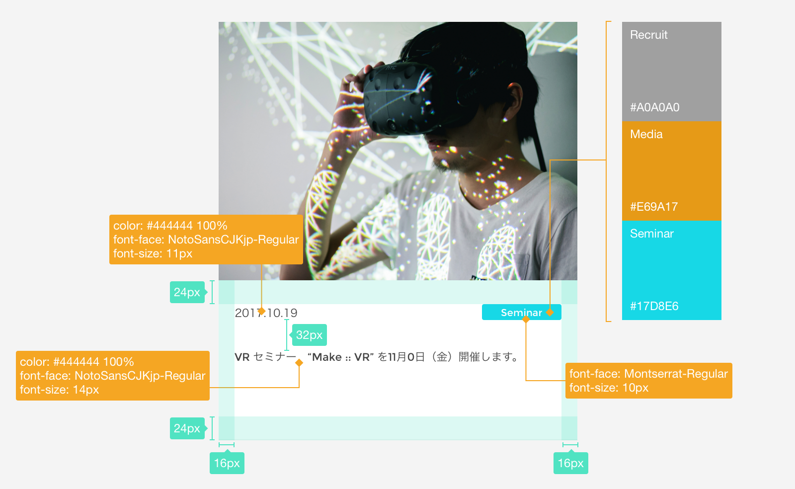

# スタイルガイド コンポーネント

## ボタン

&nbsp;
&nbsp;

## フォーム

&nbsp;
&nbsp;

## ナビゲーション

### グローバルナビ

&nbsp;

### ローカルナビ

&nbsp;

* ヘッダ
* フッタ
* ロゴ

&nbsp;
&nbsp;

## カード

## 視覚効果
* 影と標高
* 角の丸み
* テクスチャ

&nbsp;
&nbsp;

## モーション
* フィードバック
* インタラクション

&nbsp;
&nbsp;

## サウンド
* フィードバック
* インタラクション

&nbsp;
&nbsp;

## 参考

* [Material Design](https://material.io/design/)
* [Lightning by Salesforce](https://www.lightningdesignsystem.com/)
* [Carbon by IBM](https://www.carbondesignsystem.com/)
* [Trello Nachos](https://design.trello.com/)
* [Polaris by Shopify](https://polaris.shopify.com/)
* [Uber Design](https://www.uber.design/case-studies/rebrand-2018)
* [Airbnb Design](https://airbnb.design/building-a-visual-language/)
* [Invision Design System Manager](https://www.invisionapp.com/design-system-manager/)