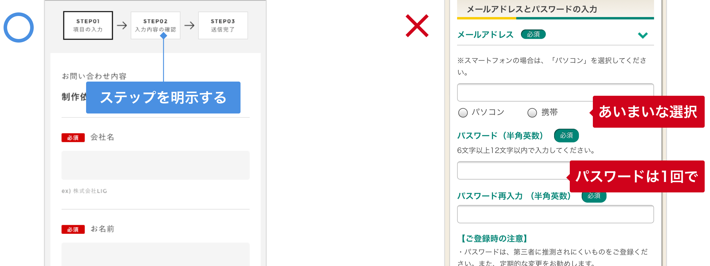
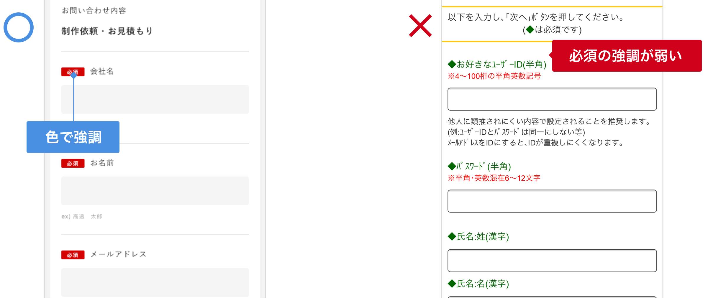
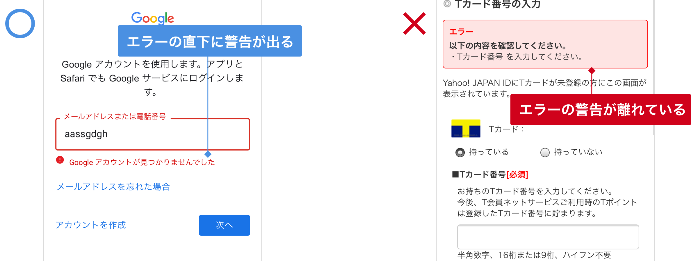
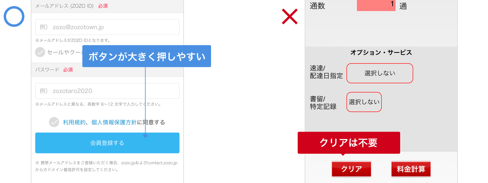
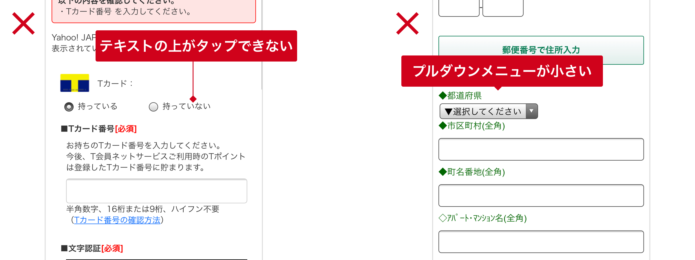
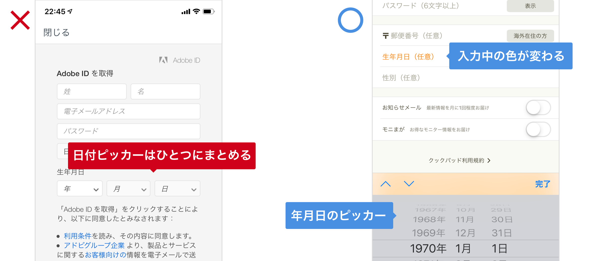
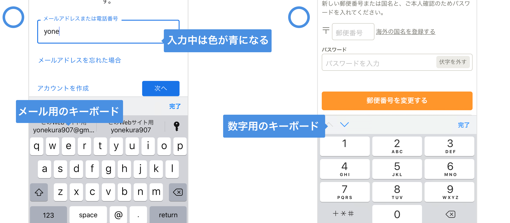

# EFO 

---

EFO(Entry Form Optimization)とは、入力フォームの最適化を指しています。入力フォームはサービスとユーザーを繋ぐ重要な項目です。ユーザーの入力負担を可能な限り減らすことで離脱を防ぎ目的を達成する確率を上げます。

&nbsp;
&nbsp;

## 遷移/項目数

最初に新規の**アカウント作成**させることが最優先。最低限の**メールアドレス**と**パスワード**だけで会員にして、氏名や住所などの細かい情報は後から入力させる。

* ステップを配置して、どの程度で終わるのかユーザーに明示する
* 入力数は可能な限り絞る
* 姓名や電話番号なのどの入力の分割はしない
* メールアドレス、パスワードの入力は1回で

&nbsp;

&nbsp;
&nbsp;

## 必須/任意

ユーザーは基本的には並べられた項目全てに応えなければ進めないと考えます。入会や購買の様な大事な入力フォームで不用意にアンケート的な項目を増やすべきではありません。

* 必須入力が不足していると確認画面へ進めないようにする
* 必須を示す注釈は、ラベルにして強調する（※や[ ]、文字色変更だけでは目立たない）
* 必須項目の入力欄は、背景色などを変えて強調する
* 任意項目は任意であることが分かる（**基本的に任意項目は作らない方が良い**）

&nbsp;

&nbsp;
&nbsp;

## エラー通知

ユーザーは必ず間違えるものと前提して、間違えたときの補助を用意する必要があります。

* 入力の時点でエラーを知らせる
* どこがエラーなのかわかりやすくする（タイトルと各エラー詳細表示）

&nbsp;

&nbsp;
&nbsp;

## ボタン

ユーザーが操作するものは押しやすく明確に配置する必要があります。指でボタンの中の文字が隠れる可能性も考慮しましょう。

* スマホの画面サイズに合わせて大きく押しやすいサイズに作る
* ボタン（送信ボタンなど）の文言は、次ページで何が起きるのか具体的に想像できる簡潔なものを用意する
* 次へ進むボタンは右、戻るボタンは左に配置する
* 「キャンセル」「クリア」「リセット」ボタンは基本的に不要、入力情報が消えないようにする

&nbsp;
&nbsp;

## ラジオボタン/プルダウン

スマホにはPCよりも多くの入力支援機能が備わっています。ユーザーが選択肢を選ぶプルダウンではスマホのピッカーを利用することで入力エラー防ぐ可能性があります。

* スマホの大きさに合わせて目立つように作る
* ラジオボタン/プルダウンなど内容に対して適切なものを使用している
* テキスト部分のタップでも選択できるように実装する

&nbsp;

&nbsp;
&nbsp;

##  入力欄/入力操作

直接入力はユーザーの負担が最も高い操作です。キーボードを最適化したり、直接入力ではない選択肢を検討することも離脱を防ぐ為に効果のある最適化です。

* 誤操作を避けるために**入力欄は大きく**する
* 入力例を**入力エリアの中か横**（下ではなく）に表記する
* 入力ボックスは分割しない方が良い（電話番号や郵便番号など）
* 入力支援機能を実装する（郵便番号など）
* 一般的な書式はすべて受け入れてエラー扱いにしない（全角、半角、スペースなど）
* 一つの入力ボックスで複数の文字種類の入力を求めない（英字と仮名の混合など）
* 画面を拡大縮小させない（ピンチ操作なしで片手操作できるようにする）
* 入力内容に合わせて、英数字や仮名など**キーボードを最適化**する
* 入力中の項目は入力欄内の色などを変えて、現在地をわかりやすくする

&nbsp;

&nbsp;
&nbsp;

## リンク / 離脱対策

入力中には

* 成約に関係のないリンクはすべて外す
* 離脱しそうになったらアラート表示させて引き止める

&nbsp;
&nbsp;

&nbsp;
&nbsp;

&nbsp;
&nbsp;

---

<!--###  出典

[【EFO対策】入力フォーム最適化に必須の9つのルール](https://sinap.jp/blog/2015/04/efo02.html)

-->