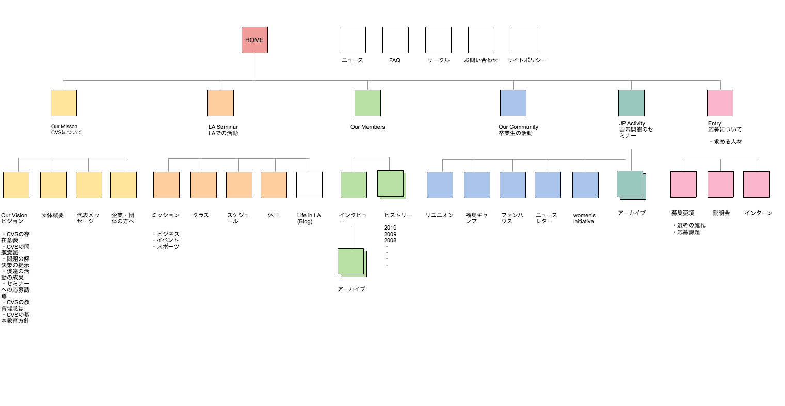
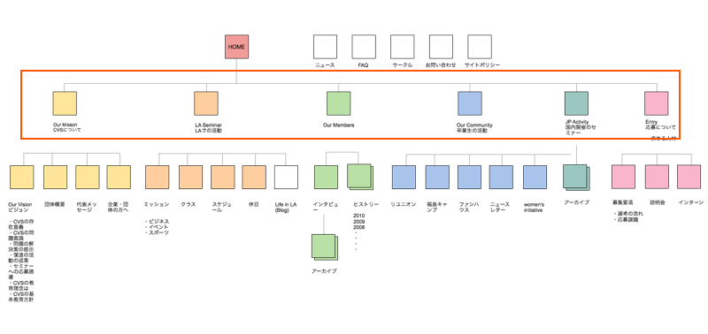

# サイトマップ 

---

&nbsp;
&nbsp;

## サイトマップの作成の手順

下位階層から順に洗い出し、構造化させる作成方法

* ステップ1：コンテンツの洗い出し

* ステップ2：コンテンツをカテゴリ化

* ステップ3：サイトマップを作成

&nbsp;

&nbsp;
&nbsp;

## ステップ1：コンテンツの洗い出し

ペルソナモデル・カスタマージャーニーマップ・リーンキャンバスをもとに、サイト内に必要なコンテンツを書き出す。

&nbsp;
&nbsp;

## ステップ2：コンテンツをカテゴリ化

ステップ1で洗い出したコンテンツをグループでカテゴライズする。
構造化されたカテゴリ数がメインナビゲーションの数となる。
カテゴリ数が適度な数でなければユーザーは迷いやすい。
洗い出されたコンテンツをカテゴリにまとめる（情報の組織化）

&nbsp;
&nbsp;

## LATCH法とは

リチャードワーマンによる情報を組織化する定義

* Location　位置による組織化
* Alphabet　アルファベットによる組織化
* Time	　時間による組織化
* Category　分野による組織化
* Hierarchy　階層による組織化

情報を詰め込み過ぎると機能としての多様性は実現できるが、逆にユーザーを迷わす原因ともなる。本来の目的をシンプルに達成させるための排除や取捨選択も考慮する必要がある。

&nbsp;
&nbsp;

## ラベリング

グループ化したカテゴリに適切な名称をつけることを**ラベリング**と呼ぶ。
ラベリングはユーザーの理解度を優先させる。関係者しか理解できない業界用語は避けて、ペルソナモデルでわかりやすいか確認する。

### 同じ意味で異なるラベリング

ホーム  or トップ
ショップ or ストア 
買い物カゴ  or  ショッピングカート
企業情報 or 会社概要
お知らせ or インフォメーション
新着情報 or What’s New

&nbsp;
&nbsp;

## ステップ3：サイトマップを作成

カテゴリ毎にトップページを作成する。カテゴリトップを繋げる（リンクする）全体のトップページを作成する。

&nbsp;
&nbsp;

---

<!--###  出典

[【EFO対策】入力フォーム最適化に必須の9つのルール](https://sinap.jp/blog/2015/04/efo02.html)

-->