# アイコン

アイコンは、それらが持つ“機能”や“操作の結果どのような情報を得られるか”を、抽象化したグラフィカル表現です。このレッスンでは、ピクトグラムの概念、デザイントレンドなどについて理解を深めアイコンの設計法を学びます。

&nbsp;
&nbsp;

## ピクトグラムの用途
ピクトグラムは街の交通標識や建物の内の案内で使われていました。現代ではWebデザインやスマートフォンアプリでもよく疲れていて一般的に幅広く浸透しています。
ピクトグラムは、例えば見る人がその文字が読めなかったとしても、ピクトグラムの形を見て瞬時に、内容を理解できるメリットがあります。

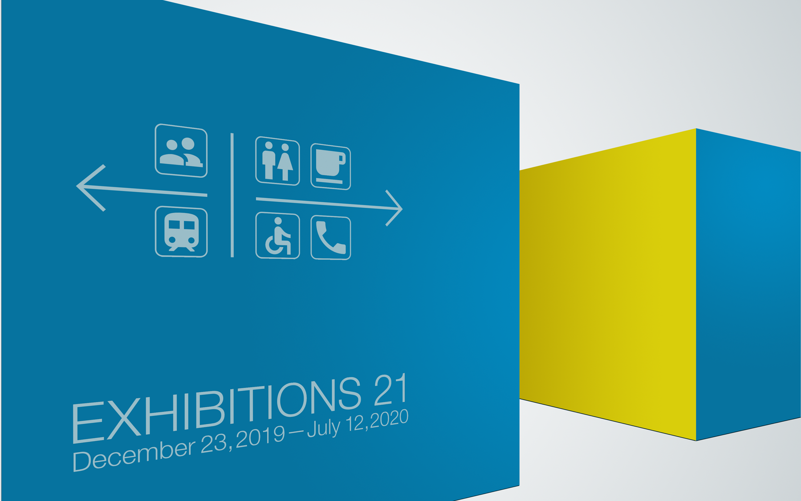

&nbsp;
&nbsp;

## ピクトグラムの歴史
ドイツを代表するグラフィックデザイナー、オトル・アイヒャーが手がけ1972年のミュンヘンオリンピックで採用されたピクトグラム。各競技種目のピクトグラムをグリッドシステムを使い統一性の高い規格として実現した。

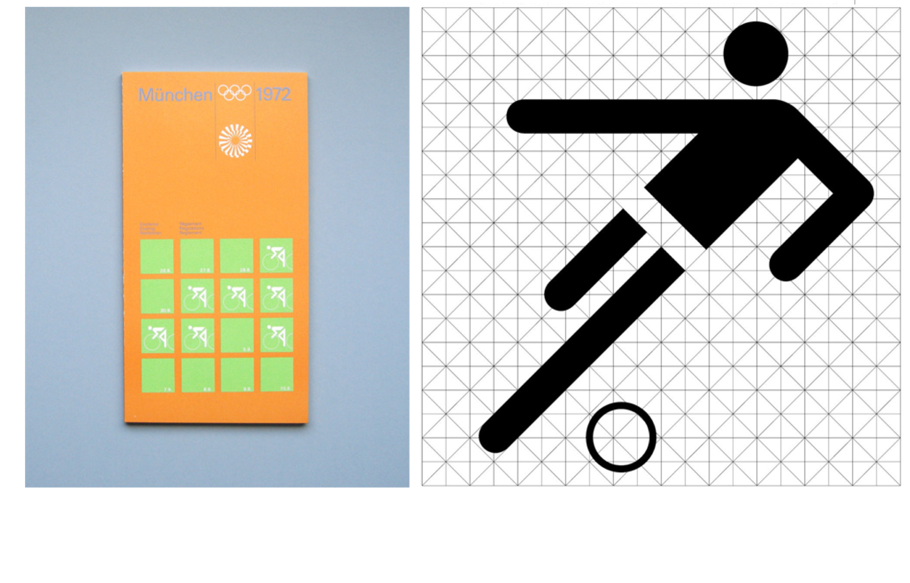

[Otl Aicher Munich Olympics Pictograms](https://www.piktogramm.de/en/)

&nbsp;
&nbsp;

## アプリケーションでのピクトグラム(アイコン)
アプリデザインでは情報を抽象化したピクトグラム(アイコン)が使用されています。アイコンは言語に依存せず、文字を読まなくても瞬時に情報を理解させることができます。アイコンはメニューやボタンとして頻繁に使われることが多く、複数のアイコンを同じ形状で並べて統一感を出す必要がある為、グリッドを意識した正方形で設計することが望ましいとされています。  
実際にアイコンを作る際には、特に以下のことに留意して作業に取り組むと良いでしょう。

&nbsp;
&nbsp;

## 抽象化
アイコンには“認識されやすさ”や“何を表しているのかの明快さ”が必要です。そのアイコンが表現すべき物や概念、行為について、見る者が容易にその内容を認識できるよう、対象の特徴をシンプルかつ端的さを心がけると良いでしょう。
アイコンは抽象化された図なので元となるオブジェクトの選定から考える必要があります。原型から装飾的要素をと取り除き必要最低限の情報まで削ぎ落として、最もシンプルな形状に変化させていきます。

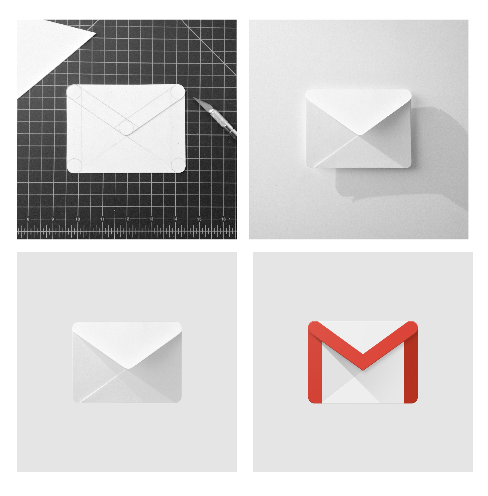

右下の例ではアイコンが飾りすぎて抽象化できていない。

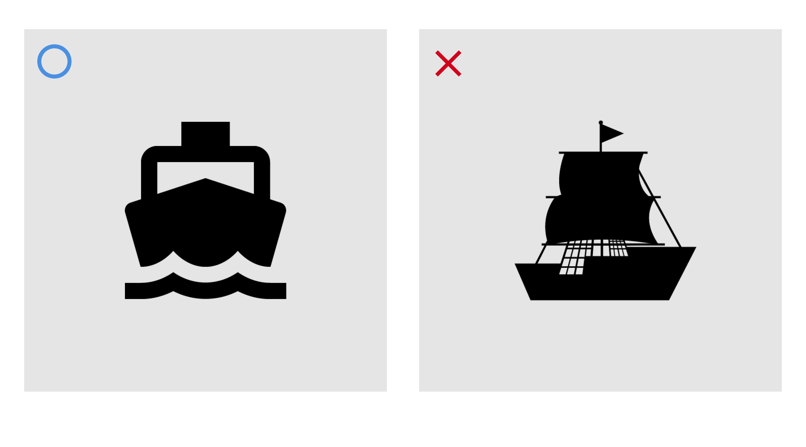

> 参照: Material Design

&nbsp;
&nbsp;

## グリッド

アプリケーションの中で様々なサイズで使用するにはグリッドを使ったアイコン作成が推奨されています。Googleの[マテリアルデザイン](https://material.io/design/iconography/)では192のグリッドを使ったフォーマットでアイコンが統一されています。

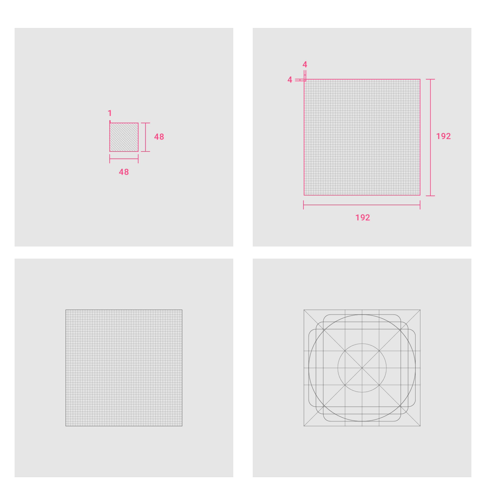

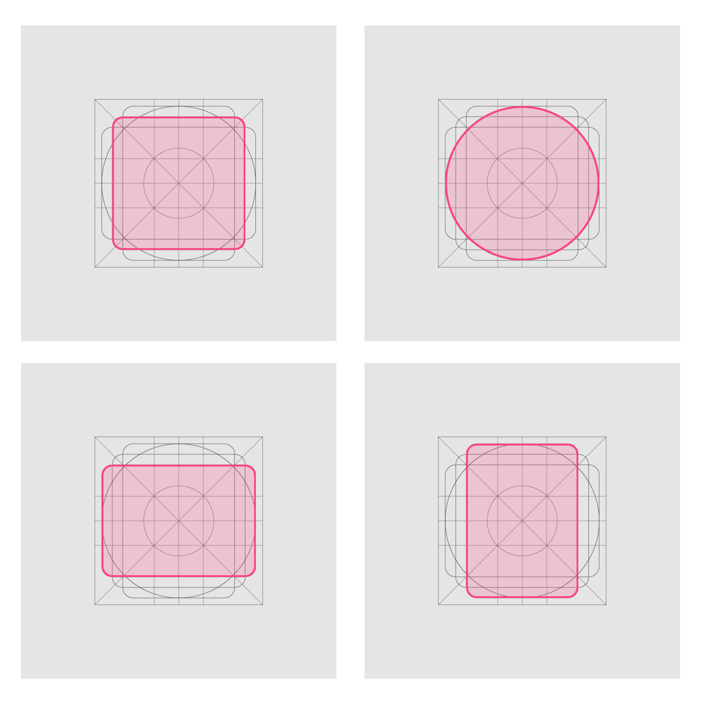

グリッドのテンプレートには正方形タイプ、円形タイプ、横長長方形タイプ、縦長長方形タイプがあります。元のオブジェクトの形状に合わせて使い分けると良いでしょう。

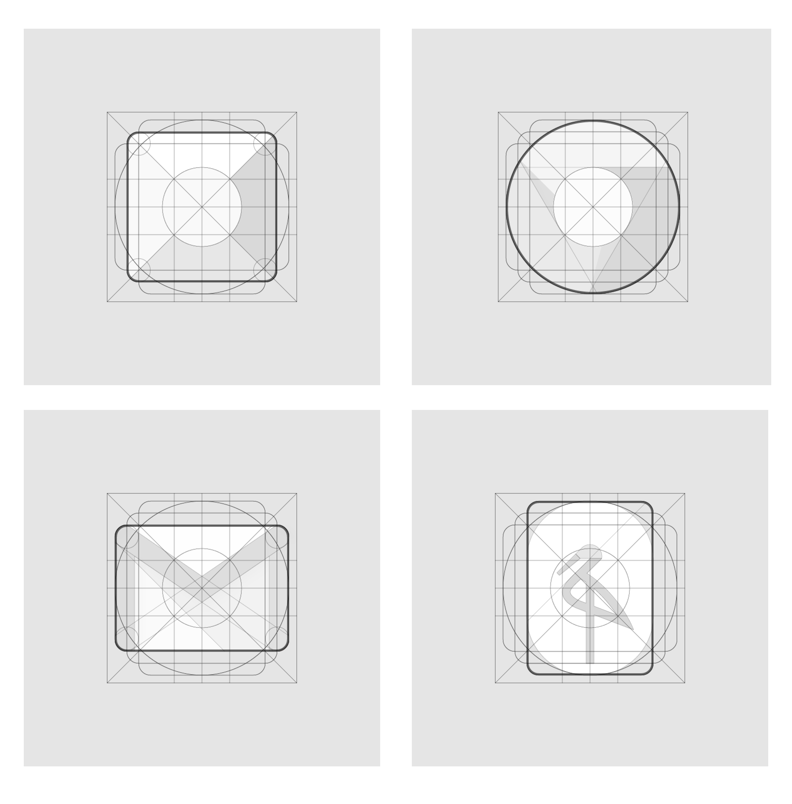

> 参照: Material Design

&nbsp;
&nbsp;

## 幾何学
アイコンに幾何学的な形状を持たせるとサイズの大小に関わらず美しくなります。アイコン作成における構造とは、アイコンの外形（アウトライン）のことです。このアウトラインは矩形や円、三角など基本的な幾何学図形を組み合わせ、単純で識別しやすくなるよう構築します。そのようにして創りだされたアウトワインには見るものに視覚的安定感や高い識別性を与えます。

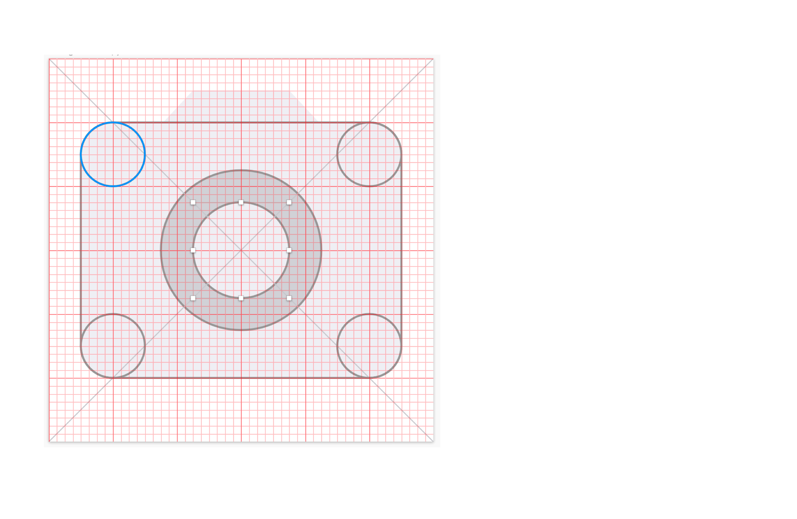

&nbsp;
&nbsp;

## 統一性

アイコンを構成する角や線の太さ、デザインスタイルの視覚的要素をルール化します。セット（複数）のアイコンを作成する際にはルール化した要素を共有させる必要があります。 

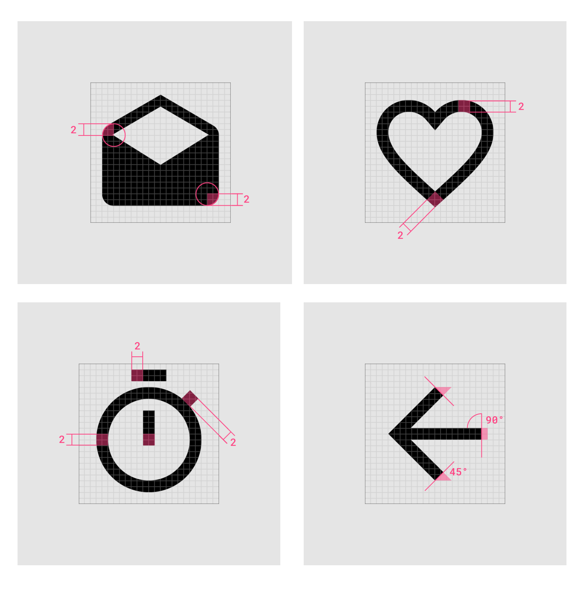

右下の例では線の太さや線の端の形状が意味がなく異なっている。元のオブジェクトに基づかない不必要な変化は避けることが望ましい。

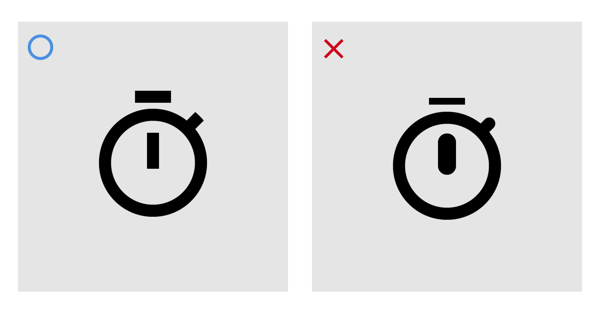

> 参照: Material Design

&nbsp;
&nbsp;

## 光学補正

オブジェクトの特徴や視覚的な補正の為に敢えてサイズを調整する場合があります。過度に適応しすぎてバランスや幾何学的に崩れない様に配慮しましょう。

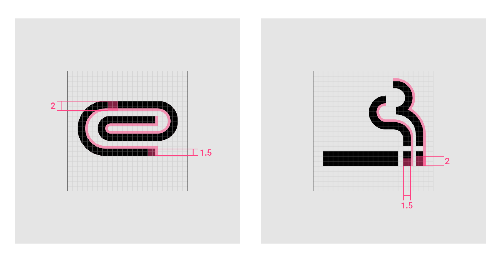
  
  
<!--最近では、フリー素材としてアイコンをダウンロードできる[Material Icon](https://design.google.com/icons/)や[Awesomeicon](https://fortawesome.github.io/Font-Awesome/)、[ionicons](http://ionicons.com)などのサービスも有ります。アイコン・デザインの参考にすると良いでしょう。-->

> 参照：[Material Design](https://material.io/design/)

&nbsp;
&nbsp;

## グリッドを使ったスケッチ

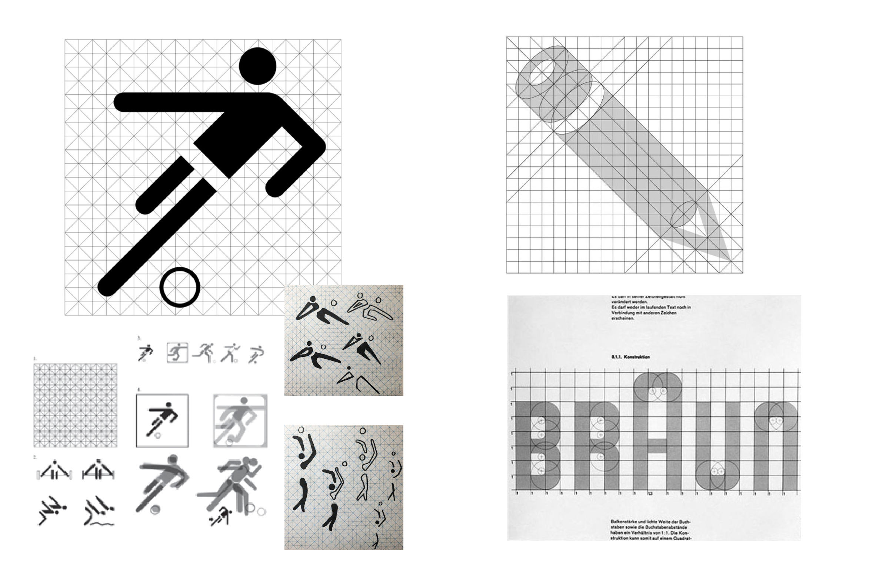

> グリッドデータ
> [ai](img/icongridsheet.ai) 
> [sketch](img/icongrid.sketch)

----