# アプリケーションアイコン

アプリケーションアイコンはiPhoneのホーム画面に配置するアイコンです。ユーザーに対して第一印象としてイメージづける大切なブランディングでもあります。他のいろんなアプリと同列に並ぶことを想定して、記憶に残る魅力あるアイコンを作成しましょう。また同じデザインをさまざまなサイズで使用するため小さいサイズでも潰れない工夫が必要です。

&nbsp;
&nbsp;

## アプリケーションアイコンのガイドラインとマスク

ホーム画面に使われるアプリケーションアイコンは角が丸いデザインを想像しますが、画像を作成する場合は丸める必要はありません。角を丸めるマスク処理はiOS側で自動的に行われます。

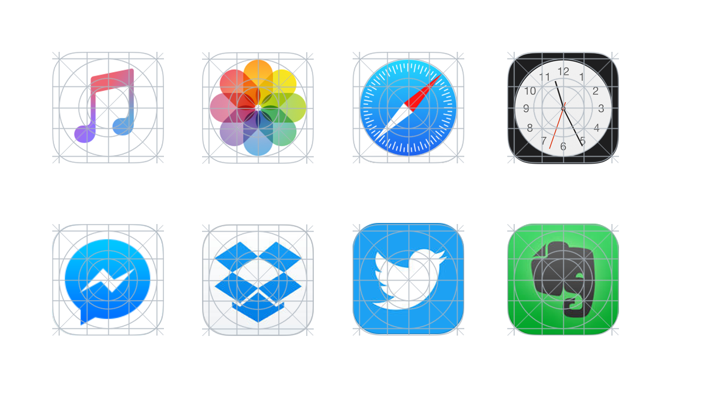

> Point: データとして角を丸める必要はありませんが、実際に使われるシチュエーションを想像して角が丸い時のデザインをイメージしましょう。

&nbsp;
&nbsp;

## アプリケーションアイコンの仕様

アプリケーションアイコンは、アイコンは、PNG形式（24ビット）の正方形で作成します。8ビットインターレースPNGは使わないでください。iPhone6 / 7 / 8 用アイコンは2倍の縦120px横120pxで作成して、iPhone 6/7/8Plus / X/Xs/XsMax 用は3倍の縦180px横180pxのサイズを用意しておく必要があります。

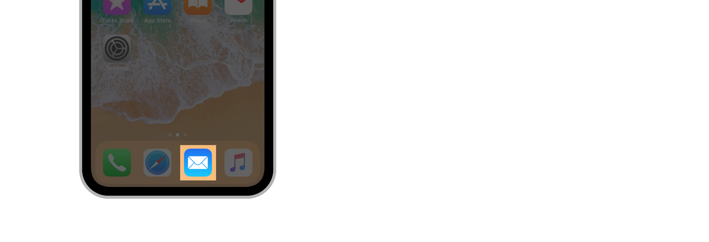

| Device or context   |      Icon size |
|:----------|:-------------|
| iPhone 6/7/8 |  	120px × 120px (60pt × 60pt @2x) |
| iPhone 6/7/8Plus X/Xs Max |    180px × 180px (60pt × 60pt @3x) |
| App Store | 1024px × 1024px (1024pt × 1024pt @1x) |

&nbsp;
&nbsp;

## Spotlight用と設定用アイコン

アプリケーションアイコン以外にも同じデザインでSpotlight用アイコンを@2x系と@3x系で、設定用アイコンは@2x系と@3x系共通で用意する必要があります。

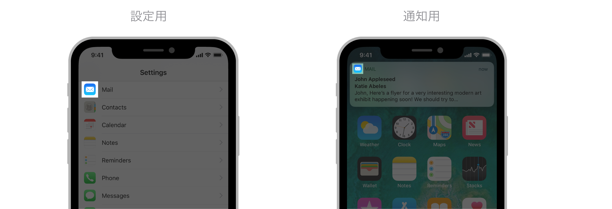　

| Device   |      Spotlight icon size |
|:----------|:-------------|
| iPhone 6/7/8 |  	80px × 80px (40pt × 40pt @2x) |
| iPhone 6/7/8Plus X/Xs Max |    120px × 120px (40pt × 40pt @3x) |

| Device   |      Settings icon size |
|:----------|:-------------|
| iPhone 6/7/8 |  	58px × 58px (29pt × 29pt @2x) |
| iPhone 6/7/8Plus X/Xs Max |    87px × 87px (29pt × 29pt @3x) |

| Device   |      Notification icon size |
|:----------|:-------------|
| iPhone 6/7/8 |  	40px × 40px (20pt × 20pt @2x) |
| iPhone 6/7/8Plus X/Xs Max |    60px × 60px (20pt × 20pt @3x) |

&nbsp;
&nbsp;

## システムアイコン

アプリケーション内で使用するアイコンには様々なシチュエーションがあります。Tabバーによる遷移や設定メニューによるステイタスの変更など、アプリの特徴を表す重要なグラフィックの部品です。

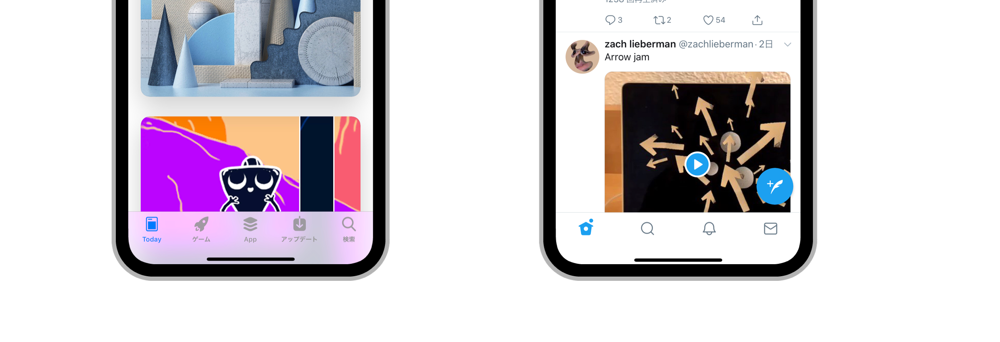

> [iOS System Icons](https://developer.apple.com/design/human-interface-guidelines/ios/icons-and-images/system-icons/)

&nbsp;
&nbsp;

## 選択と非選択

アプリケーション内で使用するアイコンは状態を示す為に最低2パターン以上必要です。**選択**している状態と、選択されていない**非選択**状態を表すものです。iOSでは選択に色相が塗られ非選択がグレースケールとなる様に推奨しています。またアイコンには塗りと線が使われますが、一貫性を保つ様に気をつけましょう。

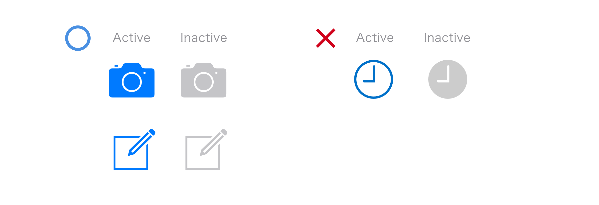
右上の例では選択が線で表現されて、非選択が塗りで表現されています。誤った使い方です。

&nbsp;
&nbsp;

## アプリケーションアイコン一覧
### App Store

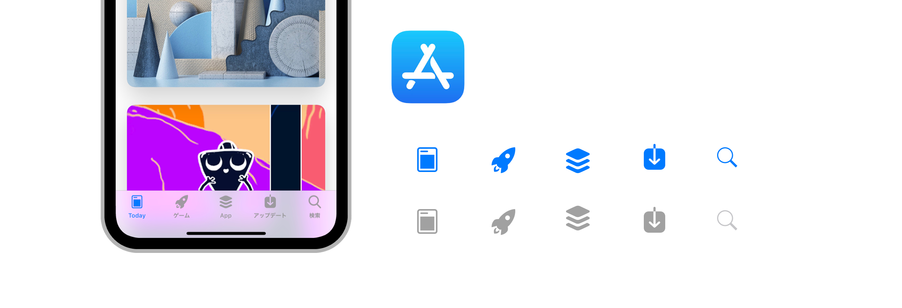

### Instagram
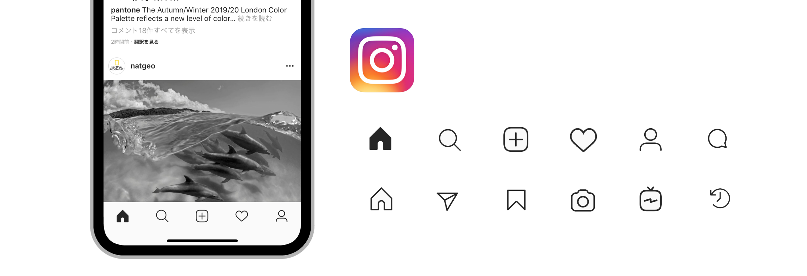

### Twitter
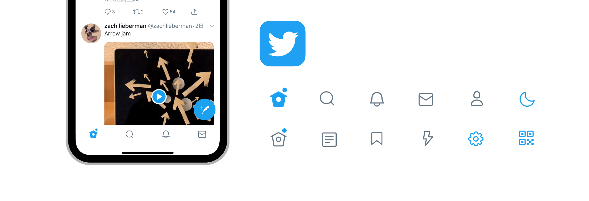

### Facebook
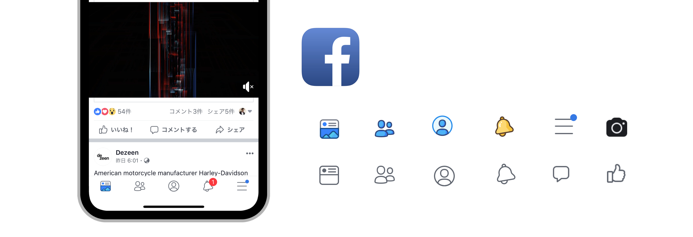

### Dropbox
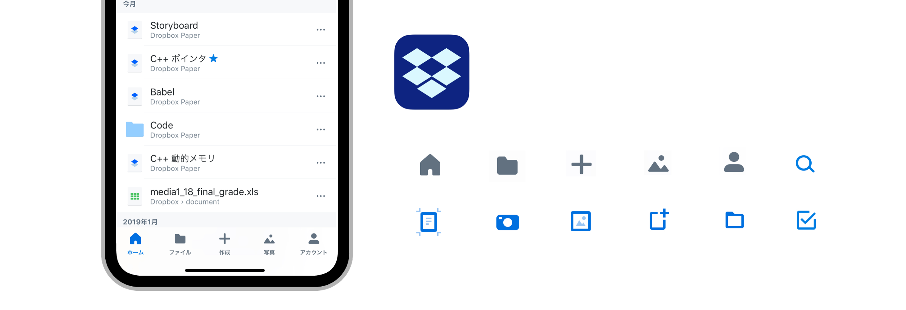

### Pinterst
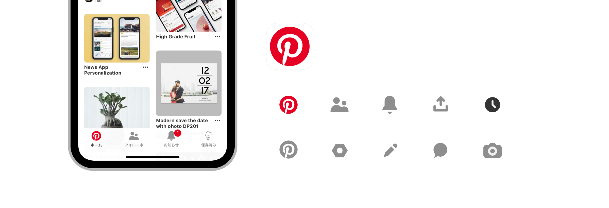

### Starbucks
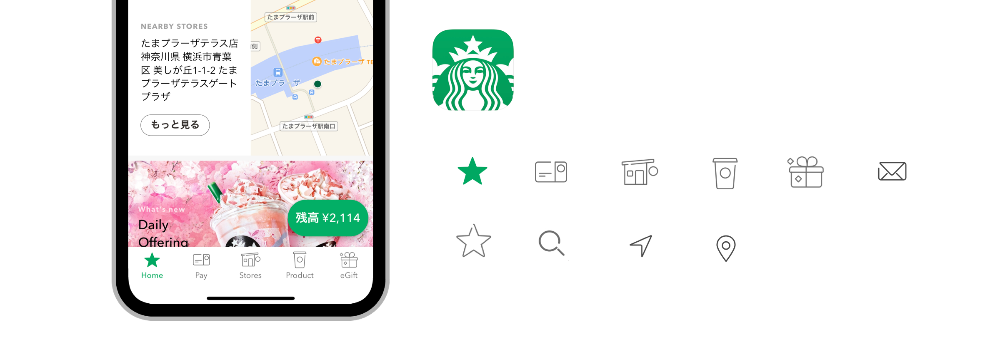

### Dribbble
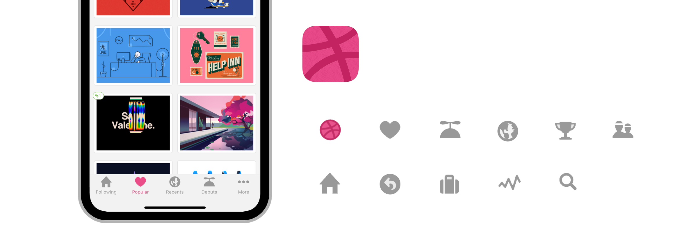

### Slack
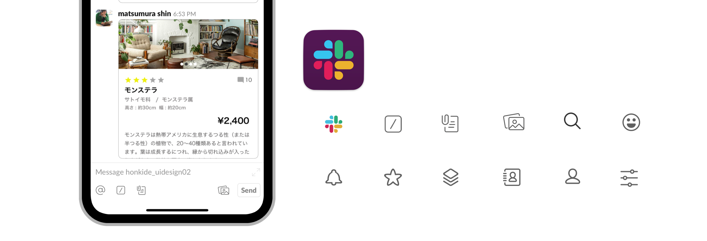

### Airbnb
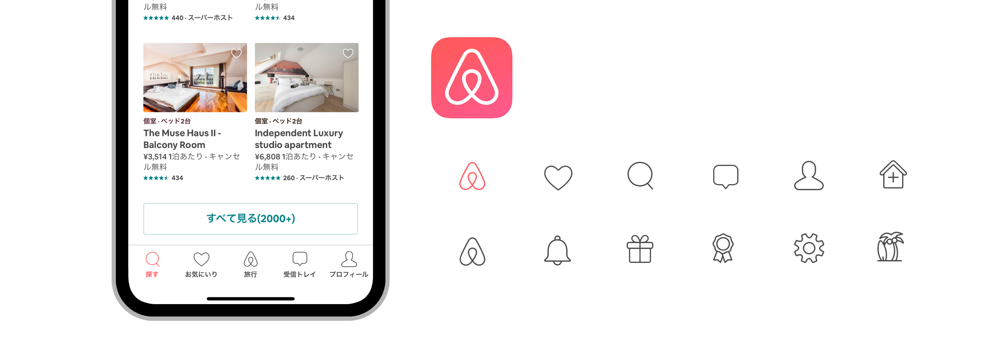

