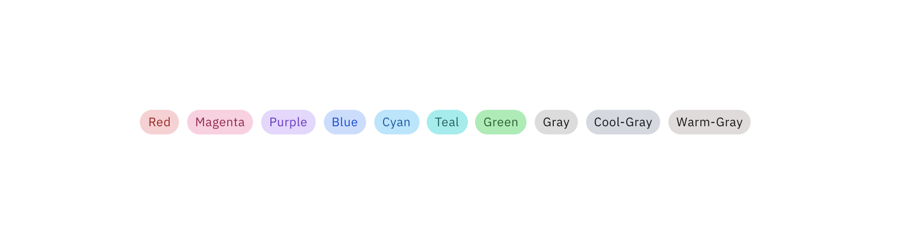

# UIコンポーネント

---

Webサイトで使用する部品を「コンポーネント」と呼ぶ

&nbsp;
&nbsp;

## Carbon Design System

IBM社が公開しているデザインシステム

[Carbon Design System](https://www.carbondesignsystem.com/)

&nbsp;
&nbsp;

## アコーディオン

開閉するリスト。開いた時と閉じた時で矢印の方向が変わる。

&nbsp;
&nbsp;

## パンくずメニュー

階層を辿るメニュー。第一階層には置かない。現在地のページにはリンクを外す。

&nbsp;
&nbsp;

## チェックボックス

項目を選択するボタン。複数選択が可能。

&nbsp;
&nbsp;

## カレンダー

日付を選択するパネル。前月と後月の遷移ができるようにする。

&nbsp;
&nbsp;

## ドロップダウンメニュー

展開するメニュー。開いた時と閉じた時で矢印の方向が変わる。

&nbsp;
&nbsp;

## テキスト入力/テキストエリア

テキスト入力は1行の文章が記述できる。テキストエリアは複数行の入力ができる。

&nbsp;
&nbsp;

## ローディング

コンテンツを表示するまでの待機アニメーション

&nbsp;
&nbsp;

## モーダル

背景を暗くして新たにピックアップされるコンテツ領域。

&nbsp;
&nbsp;

## 通知

お知らせ領域。ページ上部に置かれることが多い。

&nbsp;
&nbsp;

## プログレスインジケーター

読み込み状況を知らせるバー

&nbsp;
&nbsp;

## ラジオボタン

項目を選択するボタン。単一の選択しかできない。

&nbsp;
&nbsp;

## 検索

データの中から目的のコンテンツを探し出す

&nbsp;
&nbsp;

## セレクトメニュー

複数項目から選択するメニュー

&nbsp;
&nbsp;

## スライダー

バー上でドラッグしながらデータを調整する

&nbsp;
&nbsp;

## タブ

複数のコンテンツを同じ領域で切り替える

&nbsp;
&nbsp;

## タグ

情報を分類するために付与していくラベル

&nbsp;
&nbsp;

## トグル

オン/オフを切り替えるボタン

&nbsp;
&nbsp;

## ツールチップ

ラベルに対して補足に当たる情報領域。通常は隠れている。

&nbsp;
&nbsp;

> 参照　IBM: Carbon Design System